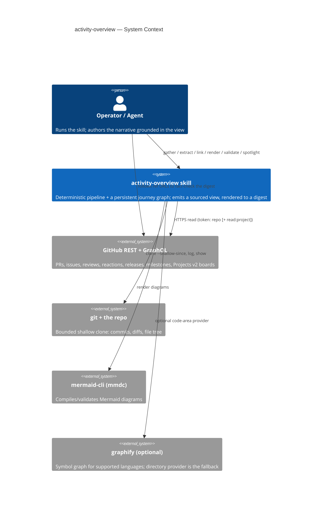
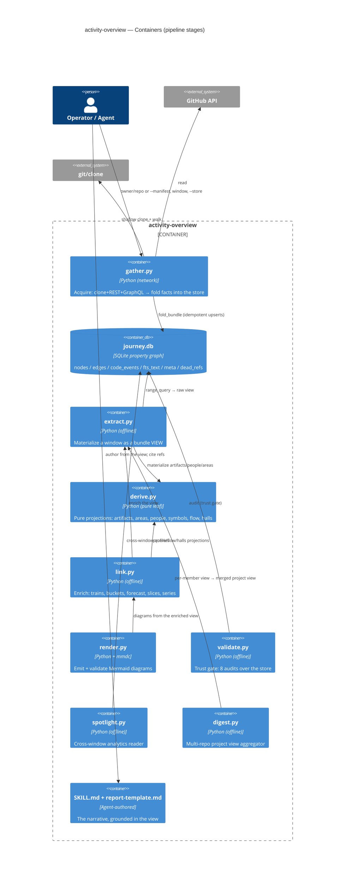
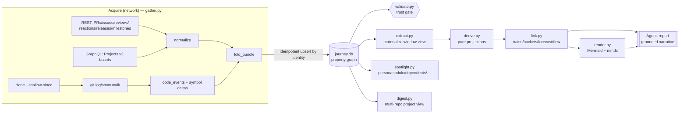
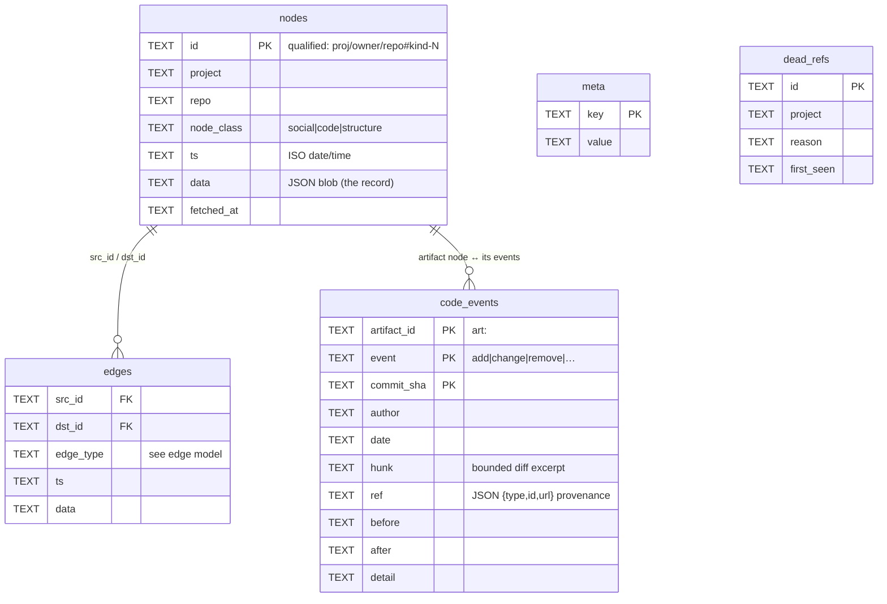
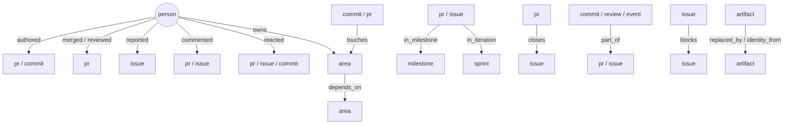
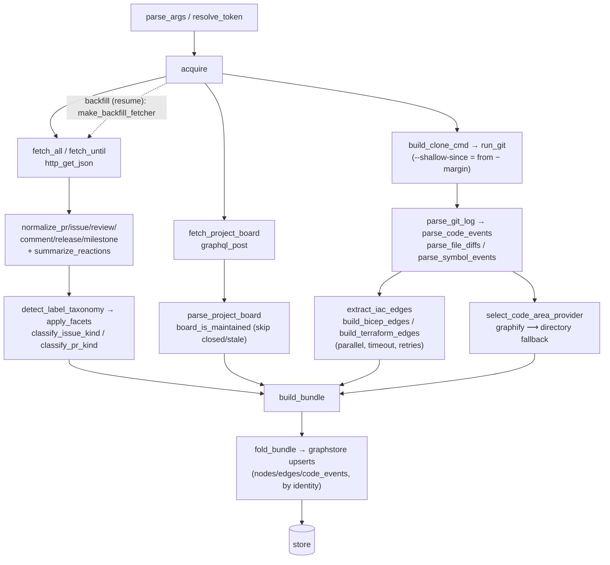
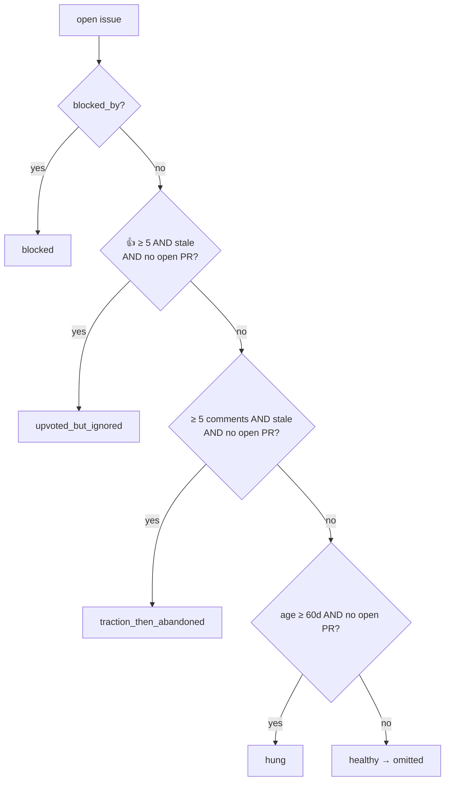
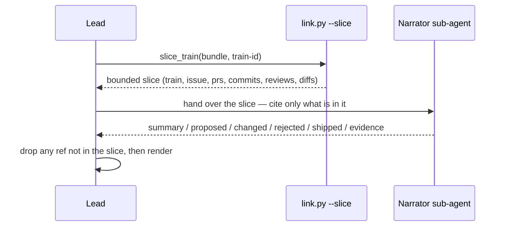

# activity-overview — L400 Technical Deep Dive

**Audience:** engineers operating, extending, or debugging the `activity-overview`
skill. This is the deep reference — for the *procedure* see `SKILL.md`, for the
*store* see `STORE.md`, for the *view contract* see `BUNDLE.md`, for *install/usage*
see `REFERENCE.md`.

**How to use this document**
- **Usage:** every tool section has a *Parameters* table and a runnable *Example*.
- **Diagnostics:** Part VIII maps symptoms → cause → fix; each tool section lists its
  failure modes.
- **Architecture:** Parts II–IV give the system, data-flow, and data-model views
  (C4 + Mermaid). Part V is the per-tool internals.

It is framed by the original design spec
(`docs/superpowers/specs/2026-06-01-activity-overview-design.md`, rev 15) — its core
principle, substrate decisions, and component list anchor everything below.

---

# Part I — What the solution is, and the principles that shape it

## 1.1 Purpose

Produce a **fact-based activity digest** for one repo (or a multi-repo project) over a
time window `[FROM, TO]`: what shipped, the decision trains behind it, who moved it,
where it's stuck, what's likely next — as sourced Markdown a human can fact-check by
following links. The targets are large IaC repos (Azure Bicep, Azure Verified Modules
in Bicep and Terraform).

## 1.2 The core principle (from the spec)

> **Gather is deterministic and decoupled. Analysis is the model's judgment.**

This single rule drives the whole architecture:

- The **pipeline** (`gather → store → extract → link → render`) is deterministic and
  emits a **verifiable, fully-sourced structured view**. It never invents prose.
- The **narrative** (the report, the per-train stories, the module biography, the
  community-call summary) is authored by the **agent/model**, grounded in that view —
  reading bounded slices and citing every claim.
- Therefore the pipeline's *product* is the **structured view (JSON)**, and the report
  is just one renderer over it (see `BUNDLE.md` → *Output contract*).

## 1.3 Substrate principle (rev 14/15)

The seam between acquire and analysis is a **persistent SQLite property graph** (the
"journey graph"), not a transient JSON file:

- `gather` is a **writer** that folds facts into the graph **by identity** (idempotent
  — re-running an overlapping window never double-counts).
- `extract` is the **reader** that materializes a window back as a bundle *view*.
- The graph **accretes over time**: a six-month digest is a wider `range_query`; a
  refresh re-folds against a pinned clone SHA. It lives on the machine using it.

## 1.4 Provenance principle (hard requirement)

Every narrative-bearing fact resolves to a `ref = {type, id, url}`. Provenance is a
*column* in the store (`code_events.ref`) and an enforced gate (`validate.check_provenance`
ERRORs any social/code node without a ref). Narrator sub-agents must cite refs copied
**verbatim** from their slice; the lead drops any ref not present in the slice.

---

# Part II — Overall architecture

## 2.1 System context (C4 L1)



## 2.2 Containers (C4 L2) — the pipeline stages



## 2.3 Data flow (the happy path)



**Read the diagram as the contract:** everything left of `journey.db` is deterministic
acquisition; everything right is deterministic projection **plus** the agent's grounded
narration (`RPT`). `validate.py` sits on the store as the gate that must pass before any
report is trusted.

---

# Part III — The data substrate (the journey graph)

All SQL lives in `graphstore.py` (`SCHEMA_VERSION = 1`, stdlib `sqlite3` only). Callers
use typed helpers; they never write SQL.

## 3.1 Schema (ER)



Plus `fts_text` — an FTS5 virtual table for full-text search (gated on FTS5
availability; `fts5_available()` probes it, `spotlight grep` degrades to "fts_unavailable"
rather than crashing).

## 3.2 Node classes (`NODE_CLASSES`)

| class | examples | meaning |
|-------|----------|---------|
| `social` | `pr`, `issue`, `commit`, `review`, `event`, `person` | who/what happened |
| `code` | `commit`, artifact lifecycle | the code layer |
| `structure` | `milestone-<n>`, `sprint-<id>`, `release-<tag>`, `area-<path>` | scaffolding the work hangs on |

## 3.3 Edge model (`validate._EDGE_SCHEMA` — the authoritative typing)



The **spine** (`SPINE_EDGE_TYPES = closes, part_of, cross_ref, spun_off, duplicate_of`)
is what defines a **decision train**: a train is the *connected component* over spine
edges (computed via a recursive-CTE `traverse_spine`), never a stored array — so trains
are always consistent with the edges.

## 3.4 Identity & idempotency (why re-runs are safe)

- **Nodes:** `upsert_node` keys on the **qualified id** (`qualify_id` → `proj/owner/repo#kind-N`)
  with `ON CONFLICT(id) DO UPDATE`. Re-folding the same item updates in place.
- **Edges:** PK `(src_id, dst_id, edge_type)` — re-adding is a no-op.
- **Code events:** PK `(artifact_id, commit_sha, event)` + `INSERT OR IGNORE` — a commit's
  effect on an artifact is recorded exactly once.
- **People** are **project-scoped** (`qualify_person`, repo sentinel `*`) so a contributor
  aggregates across the project's repos.

This is what makes the store **accretive**: gather any window any number of times; the
graph converges.

## 3.5 Provenance, windows, dead refs, clone SHA

- `record_window` / `get_windows` track which windows were folded.
- `set_clone_sha` / `get_clone_sha` pin the tree the code graph was built against (a
  refresh re-folds against the same SHA → no mixed-SHA graph).
- `dead_refs` tombstones refs proven absent (404) so completion never re-chases them.

---

# Part IV — The view & output contracts

`extract` materializes a **bundle view** — the same shape documented in `BUNDLE.md`.
Two entry points, one shape family:

- **Single-repo:** `extract → link` → the enriched bundle (`meta`, `commits`, `prs`,
  `issues`, `trains`, `buckets`, `artifacts`, `people`, `halls`, `flow`, `blockers`,
  `timeline`, `feature_deltas`, `modules`, `forecast`, `sprints`, `series`, `diagrams`, …).
- **Multi-repo:** `digest.py` → the project view (`meta`, `members[].bundle`, `trains`,
  `module_edges`, `shipped`, `people`, `modules`, `related_work`).

Both carry `meta.schema_version` (= 1) and are canonical JSON (diff-stable). Every fact
carries a ref. Reference formatters: `samples/build_report.py` (Markdown skeleton) and
`examples/formatters/shipped_changelog.py`. See `BUNDLE.md` → *Output contract*.

---

# Part V — Per-tool deep dives

Each tool: **role → parameters → internals → example → failure modes.**

## 5.1 `gather.py` — the Acquire layer (the only networked tool)

**Role.** Clone the repo (bounded), pull GitHub facts (REST + GraphQL), walk the diff
for code events, resolve IaC dependency edges, and **fold** everything into the store.
3,547 lines — the largest tool. The sole output is the store (no bundle file).

### Parameters

| Flag | Default | Purpose |
|------|---------|---------|
| `--owner` / `--repo` | — | single-repo target (mutually exclusive with `--manifest`) |
| `--manifest PATH` | — | multi-repo project manifest (fold many repos under one project) |
| `--from` / `--to` | — | window (YYYY-MM-DD) |
| `--ref-date` | `--to` | reference point for milestone/sprint/forecast/flow framing |
| `--branches` | `main` | mainline(s); first is `base_branch` (shipped-to-main test) |
| `--clone-dir` | auto | where to clone; reuse to enable `--no-clone` |
| `--no-clone` | off | reuse an existing clone (still runs `git log`) |
| `--no-workflows` / `--include-workflows` | on | CI workflow-run stats |
| `--no-releases` / `--include-releases` | on | releases in window |
| `--no-project-board` / `--project-board` | on | Projects v2 board ingest (auto-discovered) |
| `--store PATH` | **required** | the SQLite journey graph to fold into |

**Env knobs:** `ACTIVITY_CLONE_MARGIN_DAYS` (14 — shallow-since margin so in-window
commits keep a real parent), `ACTIVITY_BOARD_STALE_DAYS` (365), `ACTIVITY_BOARD_MAX_ITEMS`
(5000), `ACTIVITY_IAC_BUILD_TIMEOUT` (300s/subprocess), `ACTIVITY_IAC_MAX_WORKERS` (8),
`ACTIVITY_IAC_RETRIES` (1), `TF_PLUGIN_CACHE_DIR` (shared terraform plugin cache).
**Token:** `GITHUB_TOKEN` → `GH_TOKEN`; `repo` scope, plus `read:project` for boards.

### Internal architecture



Key sub-systems:
- **Bounded clone + boundary safety.** `--shallow-since` reaches `from − CLONE_MARGIN_DAYS`
  so the first in-window commit keeps a real parent. `shallow_boundary_shas` +
  `drop_boundary_events` discard phantom whole-tree diffs at the graft boundary;
  `in_window_boundary_commits` surfaces any that still landed on it (`meta.boundary_dropped_commits`).
- **Code-event walk.** `parse_git_log` → per-file `parse_file_diffs`/`parse_unified_diff`
  → `parse_symbol_events` (`detect_symbol_decl` per `symbol_lang`) → `build_symbol_deltas`
  with a `bounded_file_diff`. This is the costliest CPU stage on big repos.
- **Code-area provider.** `select_code_area_provider`: prefer `graphify` for its languages,
  else `build_directory_areas` (directory provider — primary for Bicep/Terraform).
- **IaC edges (build-only).** `extract_iac_edges` runs `bicep`/`terraform` to resolve
  `depends_on` between areas; parallel (`IAC_MAX_WORKERS`), each bounded by
  `IAC_BUILD_TIMEOUT`, retried `IAC_RETRIES`. Records `edge_extraction` status
  (`resolved|timeout|failed|skipped`). Multi-repo uses a static whole-tree scan
  (`scan_structural_terraform_areas`) so the dep graph is structural, not churn-scoped.
- **Projects v2.** `fetch_project_board` auto-discovers every linked board, drops
  closed/stale ones (`board_is_maintained`), paginates each by node id, merges
  (`parse_project_board`) → `board_status` on items + `sprint-<id>` nodes/`in_iteration` edges.
- **Fold.** `fold_bundle` translates the in-memory bundle into idempotent graphstore
  upserts. **`backfill`/`make_backfill_fetcher`** is the only other network path (resume:
  fill specific missing refs).

### Example

```bash
# single repo, board on, workflows off, wider clone margin for a sparse window
ACTIVITY_CLONE_MARGIN_DAYS=30 GITHUB_TOKEN=ghp_… \
python3 gather.py --owner Azure --repo bicep \
    --from 2026-02-27 --to 2026-04-02 --ref-date 2026-04-02 \
    --no-workflows --clone-dir workspace/bicep-clone --store workspace/journey.db
```

### Failure modes
- `error: set GITHUB_TOKEN` → export a token. `403` with SAML/PAT-lifetime headers →
  authorize SSO / shorten PAT lifetime (see `REFERENCE.md`).
- `meta.boundary_dropped_commits` non-empty → raise `ACTIVITY_CLONE_MARGIN_DAYS`, re-gather.
- Board layer empty though a board exists → token lacks `read:project` (degrades, warns).
- IaC `edge_extraction: timeout` → raise `ACTIVITY_IAC_BUILD_TIMEOUT` / set `TF_PLUGIN_CACHE_DIR`.
- **Scale:** very active repos (e.g. `Azure/bicep`) have a long per-item enrichment
  (reviews+comments+reactions) and a large code walk; a full run can exceed a constrained
  CI/sandbox step ceiling. Narrow the window or run where there is no hard step timeout.

## 5.2 `graphstore.py` — the property-graph store

**Role.** The substrate: all schema + typed accessors. No network, no business logic.

**Key API (by concern):**
- lifecycle: `open_store`, `init_schema`, `set_meta`/`get_meta`, `fts5_available`
- identity: `qualify_id`, `qualify_person`, `parse_id`
- write: `upsert_node(s)`, `upsert_edge(s)`, `add_code_event(s)`
- read: `get_node`, `get_edges`, `edges_by_type`, `get_code_events`, `range_query`,
  `project_repos`, `repo_nodes`, `repo_code_events`
- traversal: `traverse_spine` (recursive CTE → train components)
- search: `index_text`, `fts_search`
- provenance/resume: `record_window`/`get_windows`, `set_clone_sha`/`get_clone_sha`,
  `record_dead_ref`/`is_dead_ref`/`get_dead_refs`

**Example (inspect a store):**
```bash
sqlite3 workspace/journey.db \
  "SELECT node_class, count(*) FROM nodes GROUP BY node_class;
   SELECT edge_type, count(*) FROM edges GROUP BY edge_type ORDER BY 2 DESC;"
```

**Failure modes:** FTS5 missing → `fts_search` degrades (callers handle); a schema from a
newer `SCHEMA_VERSION` → treat as incompatible and rebuild.

## 5.3 `extract.py` — the window reader

**Role.** The inverse of `fold_bundle`: read a `[from, to]` window for an `owner/repo`
back into a **bundle view** byte-compatible with the original gather bundle. Materializes
`artifacts`/`people`/`areas`/`milestones`/`sprints`/`releases` from their nodes; surfaces
`board_status`/`iteration`/`blocking`/`blocked_by`. **Pure** beyond the store read.

**API:** `extract(conn, owner, repo, ts_from, ts_to) → bundle`.

**Why it matters:** the **golden-bundle equivalence gate** (`validate.no_drift` +
`test_characterization`) proves `fold → extract → enrich` reproduces the original
end-to-end output byte-for-byte — i.e. "store-derived == link-derived", no drift.

**Example (in process):**
```python
import graphstore, extract, link
conn = graphstore.open_store("workspace/journey.db")
view = link.enrich(extract.extract(conn, "Azure", "bicep", "2026-02-27", "2026-04-02"))
```

**Failure modes:** empty view → wrong owner/repo/window, or the store holds a different
project (extract is per-repo; for multi-project stores name the repo explicitly).

## 5.4 `derive.py` — pure projections (leaf module)

**Role.** Stdlib-only **leaf** (imports neither `link` nor `gather`) so the write-path and
read-path derive identical facts. Everything here is a pure function over a bundle.

**API by group:**
- provenance/ids: `ref`, `artifact_id`, `classify_artifact_path`
- artifacts/areas/modules: `build_artifacts`, `area_index`, `attribute_code_areas`,
  `build_modules`
- review texture: `annotate_review_rounds`, `annotate_reopen_count`
- people: `attribute_people_areas`, `is_bot_login`, `enumerate_participants`,
  **`annotate_people_profile`** (rich per-person metrics), **`build_halls`** (`halls.fame`,
  recognition-only)
- symbol identity: `match_symbol_moves`, `link_symbol_identity`
- flow: **`build_flow`** (issue pathology classifier), **`build_blockers`** (in-degree)

**Tunables:** `FLOW_STALE_DAYS=30`, `FLOW_UPVOTE_MIN=5`, `FLOW_TRACTION_MIN=5`,
`FLOW_HUNG_DAYS=60`.

**Flow classifier (precedence):**


**Example:**
```python
import derive
derive.annotate_people_profile(bundle)   # fills people[login] metrics
derive.build_halls(bundle)               # halls.fame ranking
derive.build_flow(bundle); derive.build_blockers(bundle)
```

## 5.5 `link.py` — the enrich layer

**Role.** Offline enrichment of the view: commit→PR resolution, **decision trains**
(spine components), **buckets**, **forecast**, **significance/effort**, per-train
**slices**, **series**. No network.

**API:** `enrich` (the entry point — calls everything in order), plus `build_trains`,
`compute_buckets`, `build_timeline`, `compute_feature_deltas`, `score_train_significance`,
`annotate_train_effort`, `slice_train`, `build_forecast`, `select_milestones`,
`select_sprints`, `train_index`.

**CLI:** `link.py BUNDLE.json` (enrich in place) · `… --slice TRAIN_ID` (emit one
train's bounded slice for a narrator) · `… --series series.json` (append + frame).

**Buckets** (one item, precedence shipped > rejected > next_candidates > in_flight) and
**forecast** tiers:

| concept | rule |
|---------|------|
| significance `tier` | `deep` for top `TRAIN_SIGNIFICANCE_TOP_N=8` or significance ≥ `TRAIN_SIGNIFICANCE_FLOOR=20.0`; else `mention` |
| stall | `effort.stalled` when idle ≥ `TRAIN_STALL_DAYS=21` |
| forecast tier | score ≥ `5.0` likely · ≥ `2.0` possible · else longshot (`FORECAST_OVERDUE_DAYS=200`) |
| slice caps | text `SLICE_TEXT_CAP=1500`, comments `SLICE_COMMENTS_KEPT=6`, diffs `SLICE_DIFF_CAP=6000` |

**The slice → narrator contract (Phase 4b):**


**Example:**
```bash
python3 link.py workspace/view.json --series workspace/series.json
python3 link.py workspace/view.json --slice train-pr-19214   # narrator input
```

**Failure modes:** a train "not found" for `--slice` → wrong id (list `bundle["trains"][].id`).
Empty buckets → nothing merged in window (widen `--from/--to`).

## 5.6 `render.py` — diagrams (the only tool needing `mmdc`)

**Role.** Pure Mermaid emitters → `.mmd` files, each **compiled by `mmdc`** so a diagram
that wouldn't render **fails the run**. Records `bundle.diagrams` (path map).

**Parameters:** `bundle` (positional) · `--diagrams-dir` (`workspace/diagrams`) ·
`--export` (svg/png) · `--skip-validate` (skip mmdc) · `--train ID` (one flowchart on demand).

**Diagrams:** `buckets_pie`, `timeline_gantt`, `content_timeline`, `deltas_bar`,
`contributor_graph`, `kind_breakdown`, `module_graph`, `blocker_graph`,
`project_module_graph`, and `train_flowcharts[id]` (per deep train).

**Example:** `python3 render.py workspace/view.json` →
`workspace/diagrams/*.mmd` + `bundle.diagrams`.

**Failure modes:** `mmdc` not on PATH → install `@mermaid-js/mermaid-cli`, or `--skip-validate`
to emit text only. mmdc as root → pass a puppeteer `--no-sandbox` config (see `samples/README.md`).

## 5.7 `validate.py` — the trust gate

**Role.** The CI gate. Because the report narrates entirely from the store, a wrong graph
means a lying report — so this audits the store. Self-contained (re-derives its own bundle
via `extract`).

**Parameters:** `store` (positional) · `--project` · `--repo` · `--bundle` (optional
cross-check) · `--json`. (Multi-project/-repo stores need `--project`/`--repo`.)

**The eight checks:**

| check | asserts |
|-------|---------|
| `check_referential_integrity` | every edge endpoint exists |
| `check_participant_completeness` | every contributor on the write path is in `people` |
| `check_provenance` | every social/code node carries a ref |
| `check_no_fabrication` | no node/edge without a backing fact |
| `check_schema_conformance` | every edge matches `_EDGE_SCHEMA` endpoint types |
| `check_no_drift_people` / `check_no_drift` | stored == freshly re-derived (golden equivalence) |
| `check_idempotency` | re-folding the bundle changes nothing |

**Example:** `python3 validate.py workspace/journey.db` (single) ·
`… --project avm-tf-storage` (project-wide).

**Failure modes:** "store holds multiple projects — pass `--project`"; a drift/conformance
failure is a **real defect** (fix the producer, never the golden).

## 5.8 `spotlight.py` — cross-window analytics reader

**Role.** Answers questions orthogonal to one window ("what has this person/module done
across all history?"). Reads the store; `--complete` can backfill gaps (bounded).

**Subcommands** (`spotlight.py <query> <arg> --store … [--project] [--from] [--to] [--json|--md]`):

| query | function | answers |
|-------|----------|---------|
| `person <login>` | `person_impact` | one contributor's footprint over time |
| `symbol <name>` | `pattern_evolution` | how a symbol/pattern changed across history |
| `subsystem <area>` | `subsystem_split` | activity split within a subsystem |
| `grep <text>` | `text_mining` | FTS over the corpus (degrades if FTS5 absent) |
| `module <area>` | `slice_module` | full-history module **biography** slice (narrator input) |
| `dependents <owner/repo>` | `member_dependents` | cross-repo **blast radius** |

**Example:**
```bash
python3 spotlight.py module avm/res/network/virtualnetwork \
    --store workspace/journey.db --project avm-tf-storage --json
python3 spotlight.py dependents Azure/terraform-azurerm-avm-res-keyvault-vault \
    --store workspace/journey.db --project avm-tf-storage
```

**Failure modes:** `needs_gather`/`fts_unavailable` are **valid answers** (exit 0). A thin
result → widen the store (gather more windows) or pass `--complete`.

## 5.9 `digest.py` — the multi-repo project view

**Role.** One level above `extract`: materialize each member's enriched bundle via the
single-repo pipeline, then **merge** into the project view (cross-repo trains, merged
shipped/people/modules, `related_work` ticket clusters, `module_edges`).

**Parameters:** `--store` · `--project` · `--repo` (repeatable; default = all in store) ·
`--from`/`--to` · `--ticket-pattern` (group related work by external ticket id).

**Internals:** `member_bundles` → `spine_components` (cross-repo) → `build_project_trains`
→ `group_related_work` → `project_depends_on` → `build_project_view`.

**Example:**
```bash
python3 digest.py --store workspace/journey.db --project avm-tf-storage \
    --from 2026-03-01 --to 2026-03-31 > workspace/digest_view.json
```

## 5.10 `complete.py` — train-completion orchestrator (Phase 8d)

**Role.** ONE home for completion policy: given a train's reached set + `missing` spine
refs, decide which to fill, follow the causal spine **transitively** within a budget,
and record gaps (with reasons) rather than silently dropping. `complete_train`, `annotate`.
Used by `spotlight --complete`.

## 5.11 `manifest_from_index.py` + `manifest.py` — project assembly

**`manifest_from_index.py`** generates a Phase 9 manifest from the published AVM module
index CSV. Parameters: `--avm res|ptn|utl` (append) or `--index FILE|URL|-` (append),
`--project`, `--from`/`--to`, filters `--kind`/`--status`/`--name-contains`/`--include`/
`--exclude`, `--limit`, `--out`. **`manifest.py`** (`load_manifest`, `member_slugs`)
loads/validates `{project, window:{from,to}, repos:[{owner,repo,registry?}]}`.

**Example:**
```bash
python3 manifest_from_index.py --avm res --avm ptn \
    --project avm-tf-storage --from 2026-03-01 --to 2026-03-31 \
    --name-contains storage --status Available > workspace/manifest.json
```

## 5.12 `transcript.py` — community-call normalizer (Phase 14)

**Role.** Pure, offline normalization of a **user-provided** transcript (WebVTT/SRT/plain,
no network) into clean prose for the narrator. `normalize_transcript(text)` strips the
WEBVTT header block, `NOTE`/`STYLE`/`REGION`, cue timings, SRT indices, inline tags, and
collapses rolling-caption duplicates. CLI: `transcript.py PATH` (missing file → exit 2).

**Example:** `python3 transcript.py examples/community-call.vtt`

## 5.13 `series.py` — series continuity (Phase 13)

**Role.** Pure comparison of this installment vs the prior one: `installment_snapshot`
(the compact record appended to `series.json`) and `compute_series` → `{new,
carried_over (with prior_status), forecast_loop (landed vs not_yet)}`. Wired via
`link.py --series`. The index is a convenience over the store, never an override.

---

# Part VI — End-to-end scenarios

### 6.1 Single-repo digest
```bash
python3 gather.py --owner OWNER --repo REPO --from F --to T --store workspace/journey.db
python3 validate.py workspace/journey.db
# in the skill: extract → link → render → author report (SKILL.md)
```

### 6.2 Multi-repo project (constellation)
```bash
python3 manifest_from_index.py --avm res --project avm-tf-storage --from F --to T \
    --name-contains storage --status Available > workspace/manifest.json
TF_PLUGIN_CACHE_DIR=$PWD/workspace/.tf python3 gather.py --manifest workspace/manifest.json \
    --store workspace/journey.db
python3 validate.py workspace/journey.db --project avm-tf-storage
python3 digest.py --store workspace/journey.db --project avm-tf-storage --from F --to T \
    > workspace/digest_view.json
```

### 6.3 Recurring series
```bash
python3 link.py workspace/view.json --series workspace/series.json   # each installment
```

### 6.4 Community call
```bash
python3 transcript.py workspace/call.vtt   # → Community call highlights section
```

### 6.5 Module biography / blast radius
```bash
python3 spotlight.py module <area> --store workspace/journey.db --project P --json
python3 spotlight.py dependents <owner/repo> --store workspace/journey.db --project P
```

### 6.6 Depth-over-breadth (the top-N release points)
For each `deep` train: `link.py --slice <id>` → narrator sub-agent → grounded
what/why/how/who with examples (see the v0.42 deep-dive sample). The pipeline ranks and
slices; the model narrates from the slice.

### 6.7 Scale reality (very active repos)
`Azure/bicep`-class repos: the per-item REST enrichment + code walk can exceed a hard
CI/sandbox step ceiling. Mitigations: narrow the window; `--no-workflows`; reuse the clone
(`--no-clone`); run where there's no step timeout; or use the fast release-shipped view
(releases + search-API window-merged PRs) for a quick sample.

---

# Part VII — Configuration reference

**Env vars:** `GITHUB_TOKEN`/`GH_TOKEN`; `ACTIVITY_CLONE_MARGIN_DAYS` (14);
`ACTIVITY_BOARD_STALE_DAYS` (365); `ACTIVITY_BOARD_MAX_ITEMS` (5000);
`ACTIVITY_IAC_BUILD_TIMEOUT` (300); `ACTIVITY_IAC_MAX_WORKERS` (8); `ACTIVITY_IAC_RETRIES`
(1); `TF_PLUGIN_CACHE_DIR`.

**Tunable constants** (in code): trains `TOP_N=8`, `FLOOR=20.0`, `STALL_DAYS=21`; forecast
`5.0/2.0`, `OVERDUE_DAYS=200`; slices `1500/6/6000`; flow `30/5/5/60`.

**External binaries:** `git` (required), `mmdc` (render only), `bicep`/`terraform`
(optional — IaC edges), `graphify` (optional — code areas).

---

# Part VIII — Diagnostics & troubleshooting

| Symptom | Likely cause | Fix |
|---------|--------------|-----|
| `error: set GITHUB_TOKEN` | no token | export `GITHUB_TOKEN` (`repo`, +`read:project`) |
| `403` on first call | SAML SSO / PAT lifetime | authorize SSO; PAT ≤ 90 days (Azure org) |
| Empty `shipped` | nothing merged in window | widen `--from/--to`; check `base_branch` |
| Board layer empty | no `read:project`, or no/closed/stale board | add scope; check `board_is_maintained` |
| `meta.boundary_dropped_commits` non-empty | commit on shallow graft | raise `ACTIVITY_CLONE_MARGIN_DAYS`, re-gather |
| IaC `edge_extraction: timeout` | slow `terraform init` | `TF_PLUGIN_CACHE_DIR`; raise `IAC_BUILD_TIMEOUT` |
| render fails | `mmdc` missing / bad diagram | install mermaid-cli; a compile failure is a real diagram bug |
| `validate`: "multiple projects" | shared store | pass `--project` (and `--repo`) |
| `validate`: drift/conformance | producer defect | fix gather/derive/extract — never edit the golden |
| `spotlight`: `needs_gather`/`fts_unavailable` | thin store / no FTS5 | gather more / accept (valid exit 0) |
| run never finishes (bicep-scale) | per-item enrich + code walk | narrow window; `--no-workflows`; `--no-clone`; no-step-timeout host |

**The trust loop:** never trust a report whose store doesn't pass `validate.py`. The gate
re-derives the view and asserts no drift, full provenance, schema conformance, and
idempotency — that's what makes the narrative defensible.

---

# Appendix

- **Layout:** `SKILL.md` (procedure), `REFERENCE.md` (install/usage), `STORE.md` (schema),
  `BUNDLE.md` (view + output contract), `reference/report-sections.md` (per-section
  authoring), `samples/` (worked run), `examples/` (inputs + a 2nd formatter),
  `commands/activity.md` (`/activity`), `fixtures/` + `test_*.py` (the suite),
  `docs/superpowers/specs/` (the design + per-phase specs).
- **schema_version:** 1 (on `meta` of every view and on the store).
- **Glossary:** *train* = connected component over spine edges · *bucket* = shipped /
  rejected / next_candidates / in_flight · *deep/mention* = train narration tier ·
  *slice* = one train's bounded, self-contained narrator input · *flow* = per-issue
  pathology · *halls.fame* = recognition ranking · *blast radius* = cross-repo dependents.
