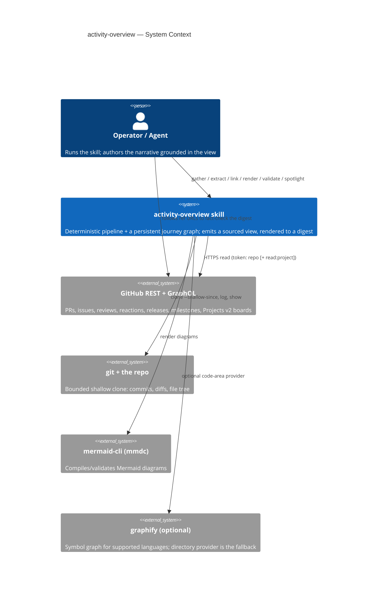
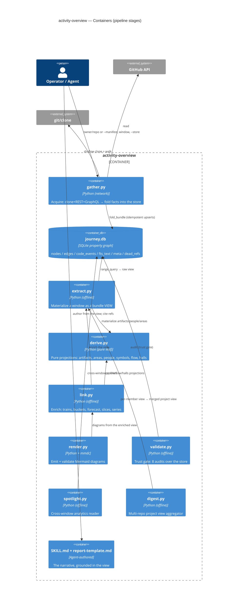
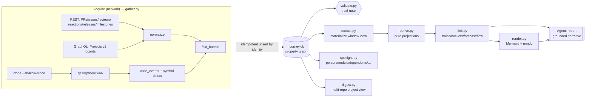
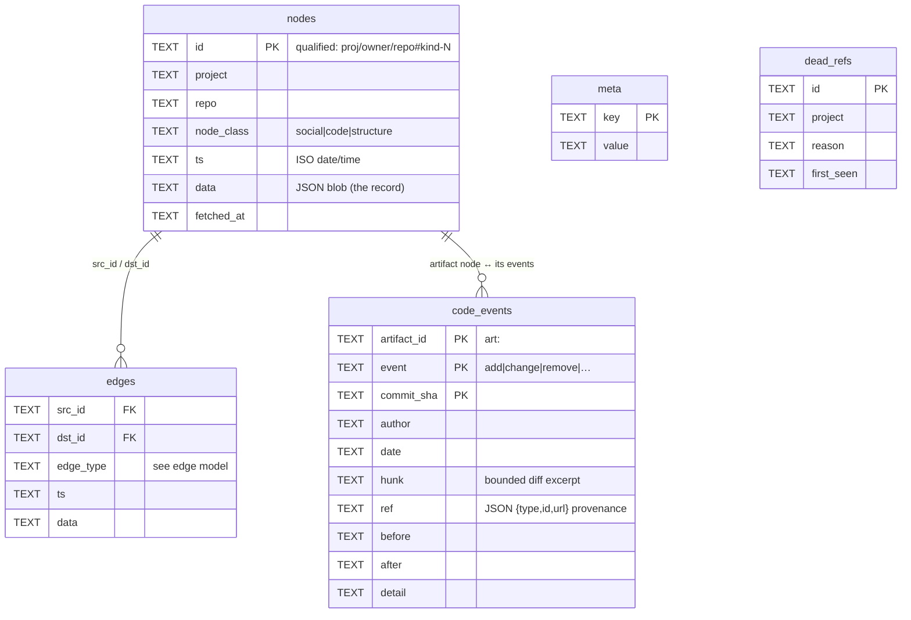
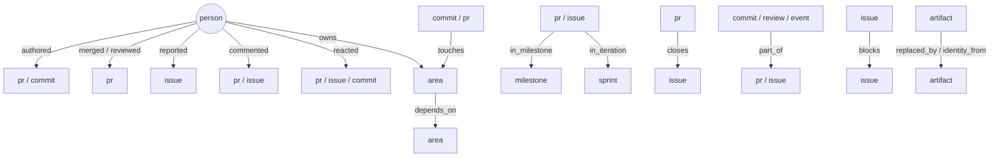
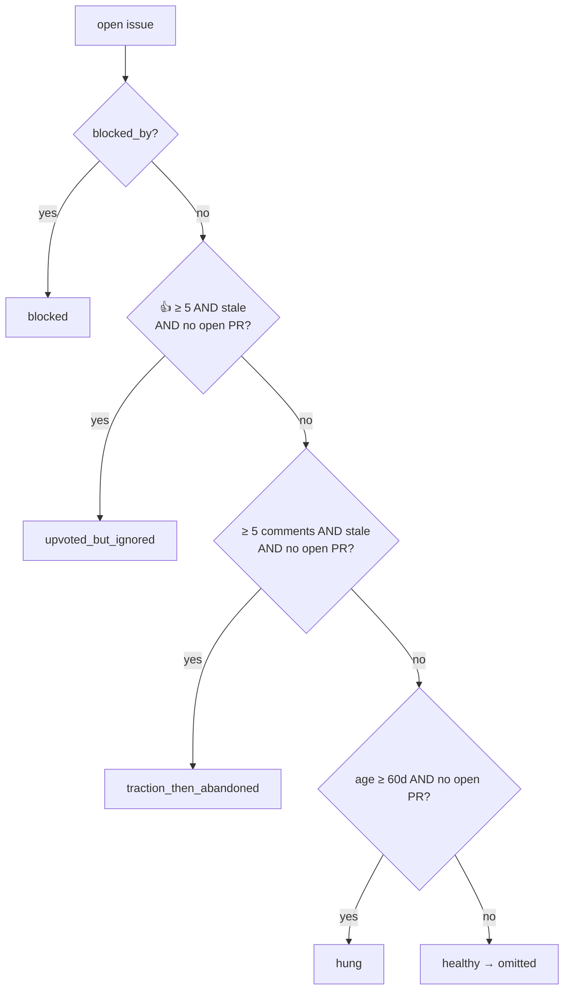
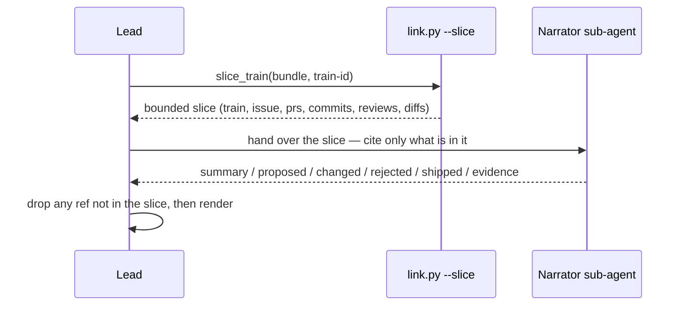

# activity-overview — A Guided Tour (L400 deep dive, told as a story)

This document follows **one digest, from question to trustworthy answer**, and explains
every moving part as we meet it. You do **not** need any background — each technology
gets a short **callout** the first time it appears, and every step is framed as
**what / why / how**. By the end you'll understand the whole solution well enough to run
it, extend it, and debug it.

> 📖 **How to read this.** The chapters tell the story in order. Boxes marked
> **🟦 New here** introduce a technology in plain language. Boxes marked **🔎 Under the
> hood** go one level deeper for the curious. The **Reference appendices** at the end are
> the dense tables (every parameter, env var, and a symptom→fix matrix) for when you're
> actually operating it.

Companion docs (deeper, narrower): `SKILL.md` (the operating procedure), `STORE.md` (the
database schema), `BUNDLE.md` (the data contract), `REFERENCE.md` (install/usage). The
whole thing is framed by the original design spec,
`docs/superpowers/specs/2026-06-01-activity-overview-design.md`.

---

# Prologue — the problem, and the one idea that solves it

Imagine you maintain a busy software project on **GitHub** and someone asks: *"What
actually happened last month, and why should I believe you?"*

> 🟦 **New here: GitHub.** GitHub is a website where teams store code and coordinate
> work. Three nouns will recur: a **commit** (one saved change to the code), a **pull
> request** or **PR** (a proposed bundle of commits, reviewed and then "merged" in), and
> an **issue** (a ticket — a bug report or feature request). People also leave comments,
> reviews, and 👍 reactions on these.

You could scroll through hundreds of PRs and issues by hand (slow, error-prone), or you
could ask an AI to "summarize the repo."

> 🟦 **New here: LLM / "the agent".** An **LLM** (large language model, like Claude) is
> an AI that writes fluent text. Its superpower — fluency — is also its trap: asked to
> summarize from memory, it will confidently **make things up** ("hallucinate"). An
> **agent** is an LLM that can also *use tools* (run programs, read files). This project
> is an **agent skill**: a folder of scripts plus instructions that teach the agent how
> to do this job properly.

The whole design rests on **one principle**, taken straight from the spec:

> ⭐ **The core principle:** *Gather is deterministic and decoupled. Analysis is the
> model's judgment.*

In plain words: **programs collect the facts; the AI only writes the story — and only
from facts it can point at.** Concretely:

- **What** the programs produce: a precise, **fully-sourced** dataset — every fact
  carries a link back to the GitHub page that proves it.
- **What** the AI produces: the readable narrative, written **only** from that dataset,
  **citing** each claim.
- **Why** this split matters: it makes the result **checkable**. If the digest says
  "PR #19261 took the console to GA," you click the link and see for yourself. The AI
  can't invent a PR that the programs didn't find.

> 🟦 **New here: deterministic.** A **deterministic** program gives the *same output for
> the same input, every time* — no randomness, no opinion. The fact-collection half is
> deterministic on purpose; that's what makes it trustworthy. The story-telling half is
> *judgment* (which facts matter, how to phrase them), which is the model's job.

Everything that follows is the machinery that makes that principle real.

---

# Chapter 0 — A map of the town before we walk its streets

Before the step-by-step, here is the whole system at a glance. We'll use two standard
"architecture postcard" styles.

> 🟦 **New here: C4 diagrams.** **C4** is a simple way to draw software at four zoom
> levels — **C**ontext (the system + who/what it talks to), **C**ontainers (the major
> runnable pieces), **C**omponents, **C**ode. We'll use the first two. They read like a
> map: boxes are things, arrows are "talks to."
>
> 🟦 **New here: Mermaid.** **Mermaid** is a tiny text language for diagrams — you write
> a few lines and a renderer draws the boxes and arrows. Every diagram in this document
> is Mermaid, and each one is *compiled and checked* so it actually renders.

**Level 1 — the system in its world.** Who runs it, and what it touches:



Read it as a sentence: *an operator (or the agent) runs the skill; the skill reads from
GitHub and from a local copy of the repo, optionally calls two helper programs, and the
operator can always click through to GitHub to verify.*

**Level 2 — the major pieces inside.** This is the **pipeline** — an assembly line where
each station does one job and hands off to the next:



> 🟦 **New here: Python / a "script".** Each station is a **Python** program — a `.py`
> text file you run from a terminal. Python is a popular, readable programming language;
> you run a script by typing `python3 name.py …arguments…`. You don't need to read Python
> to operate the skill; you just run the scripts in order with the right arguments.

The crucial shape to notice: **everything flows into one database (`journey.db`) and back
out.** The left half (`gather`) is the deterministic fact-collector; the database is the
memory; the right half projects and narrates. We'll now walk it left to right.

---

# Chapter 1 — Asking the question

A run starts with a question shaped like: *"What happened in `Azure/bicep` between
2026-02-27 and 2026-04-02?"* You express that as a command:

```bash
python3 gather.py --owner Azure --repo bicep \
    --from 2026-02-27 --to 2026-04-02 --store workspace/journey.db
```

> 🟦 **New here: the terminal & "flags".** The **terminal** (or command line) is a
> text prompt where you type commands. The words starting with `--` are **flags** —
> named settings. `--owner`/`--repo` say *which* project; `--from`/`--to` define the
> **window** (the time slice you care about); `--store` says *where to keep the
> collected facts*.

> 🟦 **New here: a token & "scopes".** GitHub won't hand data to an anonymous program, so
> you give `gather` a **token** — a secret password-like string (set as the environment
> variable `GITHUB_TOKEN`). A token has **scopes** (permissions): you need `repo` (read
> access) and, to also read project boards, `read:project`. *Why a token and not your
> password?* It's revocable and least-privilege — you can scope and rotate it.

That single command kicks off the whole assembly line. Let's follow the data.

---

# Chapter 2 — Getting the raw material (the `gather` tool)

**What it is.** `gather.py` is the only station that talks to the network. Its job:
collect every fact about the window and write them into the database. It is the biggest,
busiest tool in the system.

**Why it's separate and deterministic.** Network calls are the slow, flaky, rate-limited
part. By isolating *all* acquisition here and making it repeatable, every later stage can
run offline, fast, and reproducibly.

**How it works.** `gather` pulls from three sources, normalizes them, and folds them into
the store:



Let's meet each source.

### 2.1 The code itself — a bounded `git` clone

> 🟦 **New here: git & a "clone".** **git** is the version-control tool GitHub is built
> on; it tracks every change to the code as a chain of commits. A **clone** is a local
> copy of the repository, including its history. `gather` clones the repo so it can read
> the *actual diffs* (what lines changed) — detail the GitHub API doesn't hand over in
> bulk.

> 🟦 **New here: a "shallow" clone.** A full clone of a big project can be enormous
> (years of history). A **shallow** clone fetches only recent history. `gather` uses
> `git clone --shallow-since <date>` to grab just enough: it reaches back a margin
> (`ACTIVITY_CLONE_MARGIN_DAYS`, default 14) *before* your window so the first in-window
> commit still has a real "parent" to diff against.

> 🔎 **Under the hood: the boundary trap.** The oldest commit in a shallow clone has no
> parent, so git shows its *entire tree* as if newly added — a "phantom" diff. `gather`
> detects these boundary commits (`shallow_boundary_shas`) and drops their phantom diffs
> (`drop_boundary_events`). If a *real* in-window commit lands exactly on that boundary,
> it records the casualty in `meta.boundary_dropped_commits` so you know to widen the
> margin and re-run. *Why care?* Without this, a repo could look like "everything changed
> at once" — a subtle, silent lie.

From the clone, `gather` walks the history (`parse_git_log`) and turns each changed file
into **code events** — and even into **symbol-level** changes (a function/parameter added
or removed), with a short, bounded snippet of the actual diff. This is the costliest CPU
work on large repos.

### 2.2 The conversation — the GitHub REST API

> 🟦 **New here: an API & "REST".** An **API** is a way for one program to ask another
> for data. **REST** is the most common style: you fetch a **URL** and get back **JSON**.
> **JSON** is just structured text — lists and labelled values, like a digital form.
> `gather` calls REST URLs like `…/repos/Azure/bicep/pulls?state=closed` to list PRs,
> then enriches each with its reviews, comments, and 👍 reactions.

> 🔎 **Under the hood: pagination & why big repos are slow.** GitHub returns results
> 100 at a time — you **paginate** (fetch page after page) until you've passed your
> window. `gather` also fetches *all open* PRs/issues (needed for the "in-flight" and
> "forecast" sections) and enriches each item with several extra calls. On a very active
> repo this is hundreds–thousands of calls — the main reason a full run there can be slow.

`gather` then **normalizes** each record (`normalize_pr`, `normalize_issue`, …) into a
clean, uniform shape, and classifies it (`classify_issue_kind`: bug/feature/docs/…;
`detect_label_taxonomy`: learn this repo's own label scheme).

### 2.3 The plan — the GitHub GraphQL API (project boards)

> 🟦 **New here: GraphQL.** **GraphQL** is a second API style where you ask for exactly
> the shape of data you want in one query (instead of many REST round-trips). GitHub's
> **Projects v2** boards (the kanban-style planning boards) are only available via
> GraphQL, so `gather` makes its one GraphQL call here.

`gather` auto-discovers every board the repo links, **skips** ones that are closed or
stale (`board_is_maintained` — so a long-abandoned board can't pollute the picture), and
stamps each item with its **board status** ("In Progress", "Blocked", …) plus any sprint.

### 2.4 Optional helpers: IaC dependency edges & code areas

These targets are **Infrastructure-as-Code** repos.

> 🟦 **New here: IaC (Bicep / Terraform).** **Infrastructure-as-Code** means describing
> cloud resources in text files so they can be versioned and deployed. **Bicep** and
> **Terraform** are two such languages. A "module" can *depend on* another module;
> `gather` can run the `bicep`/`terraform` tools to resolve those **dependency edges**
> (which module uses which). This is optional — if those tools aren't installed, it's
> simply skipped.

> 🟦 **New here: code "areas" & graphify.** To group work by part of the codebase,
> `gather` assigns each file to an **area**. By default it uses the directory layout (the
> "directory provider"). If an optional tool called **graphify** is present, it uses a
> richer symbol graph for supported languages. Either way, no install is *required*.

### 2.5 Putting it in memory — `fold_bundle`

Finally `gather` **folds** everything into the database. The key word is **idempotent**:

> 🟦 **New here: idempotent.** An operation is **idempotent** if doing it again changes
> nothing. `gather` writes each fact *by its identity* (this exact PR, this exact
> commit), so re-running an overlapping window never creates duplicates. *Why it matters:*
> you can safely gather the same period twice, or extend a window — the database simply
> **converges** to the truth and **grows over time**.

> 🔎 **Under the hood: resume.** `gather` can also **backfill** — fetch just specific
> missing facts on a later run — and it remembers refs proven not to exist (`dead_refs`)
> so it never re-chases a 404.

We'll see the database itself in the next chapter.

---

# Chapter 3 — Remembering it: the journey graph (the "store")

Everything `gather` learns lands in one file, `journey.db`. This is the heart of the
system, so it's worth understanding well. The code that owns it is `graphstore.py`.

> 🟦 **New here: a database & SQLite.** A **database** is organized storage you can query
> (ask questions of) efficiently. **SQLite** is the simplest kind: the *entire database
> is a single ordinary file* on your disk — no server to install, no setup. That's why
> the journey graph is portable and "lives on the machine using it."

> 🟦 **New here: a property graph (nodes & edges).** Instead of plain tables, we model the
> data as a **graph**: **nodes** are things (a PR, an issue, a commit, a person, an area)
> and **edges** are relationships between them ("Alice *authored* PR #5", "PR #5 *closes*
> issue #2"). Each node carries a bag of **properties** (its data). *Why a graph?* Because
> the interesting questions here are about *connections* — which issue led to which PR led
> to which commits by whom — and graphs make connections first-class.

Here is the actual schema (the tables SQLite holds):



> 🟦 **New here: reading an ER diagram.** This is an **Entity-Relationship** diagram —
> each box is a table, each row is a column with its type. **PK** = *primary key* (the
> unique identifier for a row). `nodes` and `edges` are the graph; `code_events` is the
> detailed change-log; `meta` is housekeeping; `dead_refs` is the "proven absent" list.

**The three kinds of node** (`node_class`):

| class | examples | meaning |
|-------|----------|---------|
| `social` | `pr`, `issue`, `commit`, `review`, `person` | who/what happened |
| `code` | `commit`, artifact lifecycle | the code layer |
| `structure` | `milestone`, `sprint`, `release`, `area` | the scaffolding work hangs on |

**The relationships** (`edge_type`) — this is the system's vocabulary of "how things
connect" (every type is enforced; see Chapter 7):



**The single most important idea in the whole graph** is hidden in a handful of those
edges — the **spine**:

> ⭐ **The "decision train".** Some edges (`closes`, `part_of`, `cross_ref`, `spun_off`,
> `duplicate_of`) form a **spine** that links a chain of work: an *issue* → the *PR* that
> closes it → the *commits* that are part of it → a *follow-up* it spun off. A **decision
> train** is one such connected chain. *Why it's powerful:* it's how the digest tells a
> **story** ("this idea became this PR became this fix") instead of a flat list.

> 🟦 **New here: a "connected component".** Think of the spine edges as roads. A
> **connected component** is one "island" of things all reachable from each other by
> those roads. A train *is* such an island — and crucially it is **computed on demand**
> from the edges (via a database technique called a *recursive query*), never stored as a
> fixed list. So a train is always consistent with the underlying facts.

> 🔎 **Under the hood: identity = idempotency.** Nodes are keyed by a **qualified id**
> like `proj/owner/repo#pr-19261`; edges by `(from, to, type)`; code-events by
> `(file, commit, event)`. Re-folding the same fact updates-in-place or is ignored — the
> mechanical reason re-runs are safe and the graph accretes.

---

# Chapter 4 — Reading it back (the `extract` tool)

The database is great for storage, but the rest of the pipeline wants the data shaped as
a **bundle** — one tidy JSON object for "this window of this repo." `extract.py` is the
reader that rebuilds that shape from the graph.

**What/why/how.** *What:* `extract(owner, repo, from, to)` → a bundle view. *Why:* it
re-presents the relevant slice of the graph as the familiar bundle so `link`/`render` can
work without touching the database directly. *How:* it range-queries the nodes/edges in
the window and reassembles PRs, issues, commits, people, areas, milestones, sprints, etc.

> ⭐ **The "golden" guarantee.** There's a test that proves `gather → extract → enrich`
> reproduces the original end-to-end output **byte-for-byte**. Translation: *reading the
> facts back out of the database gives exactly what we put in* — no drift, no quiet
> corruption. This is what lets us trust the database as the single source of truth.

---

# Chapter 5 — Making sense of it (the `derive` and `link` tools)

We now have the raw facts as a bundle. Two tools turn facts into *insight* — still
deterministically (no prose yet).

> 🟦 **New here: a "pure" function & a "projection".** A **pure** function takes input
> and returns output with no side effects and no surprises — same input, same output.
> A **projection** is a derived view computed from existing data (like a spreadsheet
> formula). `derive.py` is a library of pure projections; `link.py` orchestrates them and
> adds the higher-level reasoning.

### 5.1 `derive.py` — the pure projections

It computes, from the raw bundle: the **artifact** lifecycle (each file/symbol's
add→change→remove story), **code areas**, **modules**, the **people** profiles, and two
people-and-flow features worth calling out:

> ⭐ **People as first-class data.** `annotate_people_profile` gives each contributor
> real numbers (PRs authored/merged, merge rate, review latency, first/last active,
> examples/docs/symbols authored, …); `build_halls` ranks a **recognition** board
> (`halls.fame`). *Why deterministic:* "who did what" should be counted, not guessed.
> (Deliberately, there is **no** shame/blame board — recognition only.)

> ⭐ **Flow — where work is stuck.** `build_flow` classifies each open issue into one
> *pathology*, and `build_blockers` ranks the issues that block the most others. The
> classifier is a simple, explainable decision tree:



> 🔎 **Under the hood: why `derive` is a "leaf".** `derive` imports nothing from `link`
> or `gather`. *Why:* both the write-path (`gather`) and the read-path (`extract`+`link`)
> can call the *same* pure functions, guaranteeing they compute identical facts — which is
> what the "golden" guarantee in Chapter 4 checks.

### 5.2 `link.py` — the enrich layer

This is where facts become the story's *skeleton*. `link.enrich` runs everything in order
and adds:

- **Decision trains** — it builds the spine components from Chapter 3 and scores each
  train's **significance**, tagging the top ones `deep` (worth a full write-up) and the
  rest `mention`.
- **Buckets** — every PR/issue is sorted into exactly one of **shipped / rejected /
  next_candidates / in_flight** (so "what shipped" is unambiguous).
- **Forecast** — a forward-looking guess of what's likely to land next, tiered
  *likely / possible / longshot*.
- **Series** — comparison to the previous installment (what's new vs carried over).

And it produces the unit the *narrator* will consume — the **slice**:

> ⭐ **The "slice".** `link.py --slice <train-id>` emits ONE train's complete, *bounded*
> evidence: the root issue, its PRs, commits, reviews, and the actual diffs — capped to a
> sane size. *Why bounded:* it's exactly what a story-writer needs and nothing more, so
> the writer can't wander beyond the evidence. This is the hand-off from "facts" to
> "story," which we meet in Chapter 8.

---

# Chapter 6 — Drawing it (the `render` tool)

People absorb a chart faster than a paragraph, so `render.py` turns bundle fields into
diagrams.

**What/why/how.** *What:* it writes Mermaid `.mmd` files (buckets pie, timeline,
contributor graph, per-train flowcharts, dependency graph, …) and records their paths in
`bundle.diagrams`. *Why a separate validated step:* a broken diagram should fail loudly,
not ship. *How:* pure text emitters build the Mermaid, then **mmdc compiles every one**.

> 🟦 **New here: mmdc.** **mmdc** (mermaid-cli) is the program that turns Mermaid text
> into an actual picture (SVG/PNG). `render` runs it on every diagram as a check — if a
> diagram wouldn't render, the run fails. It's the one station that needs this extra tool
> installed.

---

# Chapter 7 — Trusting it (the `validate` tool)

Remember the promise: *the digest must be believable*. Since the entire narrative comes
from the database, **a wrong database means a lying report.** `validate.py` is the gate
that proves the database is sound — run it before you trust any digest.

> ⭐ **The trust gate.** `validate.py` runs **eight audits** over the store. The headline
> ones:
> - **provenance** — *every* fact carries a source link (no anonymous claims);
> - **referential integrity** — every edge points at things that exist;
> - **schema conformance** — every relationship matches the allowed shapes (the edge
>   model in Chapter 3);
> - **no-drift** — re-deriving from the store reproduces the same view (the golden
>   guarantee, enforced);
> - **idempotency** — re-folding changes nothing.

> 🟦 **New here: a "CI gate".** **CI** (continuous integration) is the robot that checks
> every change automatically. A **gate** is a check that must pass before work proceeds.
> Here, `validate` is the gate that protects the one thing that matters: *can we believe
> the facts?* If it fails, the fix is always in the producer (`gather`/`derive`/`extract`)
> — **never** edit the stored "golden" answer to make the test pass.

---

# Chapter 8 — Telling the story (the agent as narrator)

Now, finally, the AI writes — but on a tight leash. For each `deep` train, the agent runs
the **narrator** protocol: it gets *only* that train's slice and must answer from it,
citing every claim.



> 🟦 **New here: a "sub-agent".** A **sub-agent** is a fresh, focused helper the lead
> agent spins up for one bounded job — here, "narrate this one train from this one slice."
> Keeping it bounded is the safety mechanism: it literally only sees the evidence, so it
> can't bring in outside (possibly wrong) knowledge.

This is exactly the **what / why / how / who** you saw in the v0.42 deep-dive: *what*
shipped, *why* it was needed (from the issue/PR body), *how* it was built (from the
commits/diff), *who* drove and reviewed it (from the people edges) — plus a runnable
example. The "rejected/changed" field is how the digest surfaces a *decision that a flat
list would hide* (a reversed approach, a renamed function). The lead then verifies and
drops any citation the slice doesn't support — the last line of defense for "no lies."

---

# Chapter 9 — Beyond a single window

The same database answers bigger questions. These tools read the *accumulated* graph, not
just one window.

- **`spotlight.py` — the analytics reader.** Cross-cutting questions: `person <login>`
  (one contributor across all time), `module <area>` (a module's full **biography**),
  `dependents <repo>` (the **blast radius** — who breaks if this changes), `grep <text>`
  (full-text search), `subsystem`, `symbol`.

  > 🟦 **New here: full-text search / FTS5.** **FTS5** is SQLite's built-in search index —
  > it lets `spotlight grep` find words across everything quickly. If a particular SQLite
  > build lacks it, `spotlight` says so and carries on rather than crashing.

- **`digest.py` — multi-repo projects.** Some products span many repositories (e.g. an
  Azure Verified Modules "constellation"). `digest.py` runs the single-repo pipeline for
  each member and **merges** them into one project view, including cross-repo trains and a
  module-dependency graph.

  > 🟦 **New here: a "manifest".** A **manifest** is a small file listing the repos in a
  > project (plus the window). `manifest_from_index.py` can even generate it from the
  > published AVM module index. You then run `gather --manifest …` to fold them all into
  > one store under one project name.

- **`series.py` — recurring digests.** If you publish monthly, `series.py` chains each
  installment to the last ("Since last installment: new vs carried-over; did last month's
  forecast land?").

- **`transcript.py` — community calls.** If the team holds a recorded call, this cleans up
  the transcript (stripping subtitle timestamps/markup) so the agent can fold a
  *grounded* "Community call highlights" section into the digest — quoting the transcript,
  never inventing.

  > 🟦 **New here: a transcript (VTT/SRT).** **WebVTT/SRT** are subtitle file formats —
  > lines of text with timestamps. `transcript.py` turns that machine format back into
  > clean readable prose for the narrator.

---

# Epilogue — the whole story in three sentences

Programs collect the facts deterministically and remember them in a graph that grows on
your disk; a trust gate proves the graph is sound and fully sourced; then the AI writes
the story **only** from that graph, citing every claim so you can check it. That is the
core principle made real — *gather is deterministic, analysis is the model's judgment* —
and it's why the digest is both readable **and** believable.

If you want to go from here: run the single-repo scenario in `REFERENCE.md`, skim a real
output in `samples/`, and keep the **Reference appendices** below open while you operate.

---

# Reference appendix A — every tool's parameters

> Operating cheat-sheet. Each tool: what it does + its full flags.

### `gather.py` — acquire → store (network)
| Flag | Default | Purpose |
|------|---------|---------|
| `--owner` / `--repo` | — | single-repo target (mutually exclusive with `--manifest`) |
| `--manifest PATH` | — | multi-repo project manifest |
| `--from` / `--to` | — | window (YYYY-MM-DD) |
| `--ref-date` | `--to` | reference point for milestone/sprint/forecast/flow framing |
| `--branches` | `main` | mainline(s); first is `base_branch` |
| `--clone-dir` | auto | clone location (reuse to enable `--no-clone`) |
| `--no-clone` | off | reuse an existing clone (still runs `git log`) |
| `--no-workflows` / `--include-workflows` | on | CI workflow-run stats |
| `--no-releases` / `--include-releases` | on | releases in window |
| `--no-project-board` / `--project-board` | on | Projects v2 board ingest (auto-discovered) |
| `--store PATH` | **required** | the SQLite store to fold into |

### `link.py` — enrich (offline)
`link.py BUNDLE.json` (enrich in place) · `--slice TRAIN_ID` (emit one train's slice) ·
`--series series.json` (append + frame "since last installment").

### `render.py` — diagrams (needs mmdc)
`render.py BUNDLE` · `--diagrams-dir` (`workspace/diagrams`) · `--export svg|png` ·
`--skip-validate` (emit text, skip mmdc) · `--train ID` (one flowchart).

### `validate.py` — trust gate (offline)
`validate.py STORE` · `--project` · `--repo` · `--bundle` (optional cross-check) · `--json`.

### `spotlight.py` — analytics (offline)
`spotlight.py <query> <arg> --store STORE [--project] [--from] [--to] [--json|--md] [--complete]`.
Queries: `person` · `symbol` · `subsystem` · `grep` · `module` · `dependents`.

### `digest.py` — project view (offline)
`digest.py --store STORE --project NAME [--repo … (repeatable)] --from F --to T [--ticket-pattern RE]`.

### `manifest_from_index.py` — build a manifest
`--avm res|ptn|utl` (or `--index FILE|URL|-`) · `--project` · `--from`/`--to` ·
`--kind`/`--status`/`--name-contains`/`--include`/`--exclude` · `--limit` · `--out`.

### `transcript.py` — normalize a transcript
`transcript.py PATH` (`.vtt`/`.srt`/`.txt`/`.md`; missing file → exit 2).

---

# Reference appendix B — configuration

**Environment variables:** `GITHUB_TOKEN`/`GH_TOKEN` (auth) · `ACTIVITY_CLONE_MARGIN_DAYS`
(14) · `ACTIVITY_BOARD_STALE_DAYS` (365) · `ACTIVITY_BOARD_MAX_ITEMS` (5000) ·
`ACTIVITY_IAC_BUILD_TIMEOUT` (300s) · `ACTIVITY_IAC_MAX_WORKERS` (8) ·
`ACTIVITY_IAC_RETRIES` (1) · `TF_PLUGIN_CACHE_DIR` (shared terraform cache).

**Tunable constants (in code):** trains — top-N=8, significance floor=20.0, stall=21 days;
forecast — likely ≥5.0, possible ≥2.0, overdue=200 days; slices — text cap 1500, comments
kept 6, diff cap 6000 chars; flow — stale 30 days, upvote min 5, traction min 5, hung 60 days.

**External programs:** `git` (required) · `mmdc` (render only) · `bicep`/`terraform`
(optional — IaC edges) · `graphify` (optional — code areas).

---

# Reference appendix C — diagnostics (symptom → cause → fix)

| Symptom | Likely cause | Fix |
|---------|--------------|-----|
| `error: set GITHUB_TOKEN` | no token | export `GITHUB_TOKEN` (`repo`, +`read:project` for boards) |
| `403` on the first call | SAML SSO / PAT lifetime policy | authorize SSO; use a PAT ≤ 90 days (Azure org) |
| Empty "shipped" | nothing merged in window | widen `--from/--to`; check the `--branches` mainline |
| Board section empty | no `read:project`, or no/closed/stale board | add the scope; the layer degrades cleanly |
| `meta.boundary_dropped_commits` non-empty | a commit sat on the shallow graft | raise `ACTIVITY_CLONE_MARGIN_DAYS`, re-gather |
| IaC `edge_extraction: timeout` | slow `terraform init` | set `TF_PLUGIN_CACHE_DIR`; raise `ACTIVITY_IAC_BUILD_TIMEOUT` |
| render fails | `mmdc` missing / a real diagram bug | install `@mermaid-js/mermaid-cli`, or `--skip-validate` |
| `validate`: "multiple projects" | one store, many projects | pass `--project` (and `--repo`) |
| `validate`: drift/conformance | a producer defect | fix `gather`/`derive`/`extract` — never edit the golden |
| `spotlight`: `needs_gather` / `fts_unavailable` | thin store / no FTS5 | gather more windows / accept (valid, exit 0) |
| Run never finishes (huge repo) | per-item enrichment + code walk | narrow window; `--no-workflows`; reuse clone (`--no-clone`); run where there's no hard step timeout |

> ⭐ **The golden rule of debugging this system:** never trust a digest whose store hasn't
> passed `validate.py`. If validate is green, the facts are sound and fully sourced — and
> the story written from them is defensible.

---

# Appendix D — glossary

**train** = a connected chain of work over the spine edges (issue→PR→commits…) ·
**bucket** = shipped / rejected / next_candidates / in_flight · **deep / mention** =
whether a train gets a full write-up · **slice** = one train's bounded, self-contained
evidence for the narrator · **flow** = an open issue's stuck-ness pathology ·
**halls.fame** = the recognition ranking · **blast radius** = the set of repos that depend
on a given one · **idempotent** = re-running changes nothing · **provenance** = the source
link attached to every fact · **schema_version** = `1` (stamped on every view and the store).
