# avm-tf-aiml-lz — Project Activity Digest (2026-03-16 → 2026-03-22)

> **Illustration, not the product.** The product is the JSON bundle (`samples/digest_view.json`) emitted by `digest.py` — the verifiable interface a downstream content agent consumes to write the narrative. This Markdown is a deterministic *structural* rendering of that bundle (tables + validated diagrams + sourced facts, no authored prose). Every value resolves to the bundle or a GitHub URL.

| | |
|---|---|
| **Project** | `avm-tf-aiml-lz` |
| **Window** | 2026-03-16 → 2026-03-22 |
| **Members** | 3 repos |
| **Generated** | 2026-06-05 |
| **Pinned clones** | `terraform-azurerm-avm-ptn-aiml-landing-zone`@`364f58182`; `terraform-azurerm-avm-res-network-virtualnetwork`@`a0bbf6176`; `terraform-azurerm-avm-res-operationalinsights-workspace`@`b796b1e5a` |

Member repositories:

- [`Azure/terraform-azurerm-avm-ptn-aiml-landing-zone`](https://github.com/Azure/terraform-azurerm-avm-ptn-aiml-landing-zone)
- [`Azure/terraform-azurerm-avm-res-network-virtualnetwork`](https://github.com/Azure/terraform-azurerm-avm-res-network-virtualnetwork)
- [`Azure/terraform-azurerm-avm-res-operationalinsights-workspace`](https://github.com/Azure/terraform-azurerm-avm-res-operationalinsights-workspace)

> ✅ **`meta.boundary_dropped_commits` empty for every member** — feature-change / content-lifecycle ledgers are complete.

## Summary

| Metric | Value |
|---|---|
| Member repos | 3 |
| Shipped (merged PRs) | 4 |
| Shipped (issues closed) | 40 |
| Decision trains | 21 |
| Cross-repo trains | 0 |
| `related_work` clusters | 0 |
| Module-dependency edges | 6 |
| — cross-repo / intra-repo | 4 / 2 |
| People (of which bots) | 88 (3) |
| Modules (repo-qualified areas) | 23 |

## Cross-repo module dependency graph

`view["module_edges"]` — resolved Terraform `depends_on` (consumer area → the member area it sources). Cross-repo = a member sourcing another member's module.

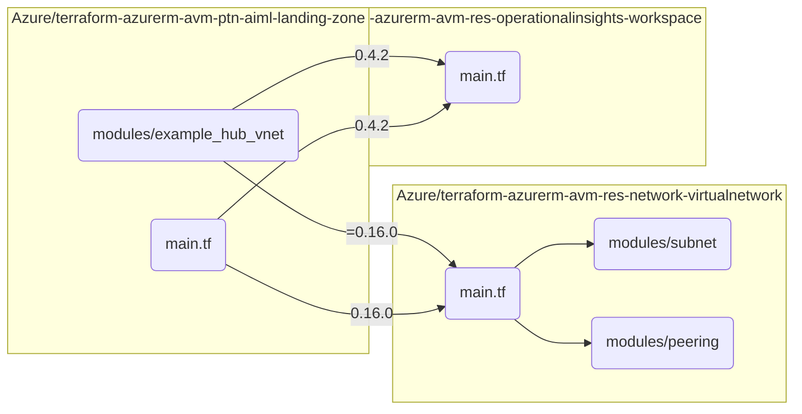

| Consumer (repo · area) | Depends on (repo · area) | Version | Cross-repo | Transitive |
|---|---|---|---|---|
| `terraform-azurerm-avm-ptn-aiml-landing-zone` · `main.tf` | `terraform-azurerm-avm-res-network-virtualnetwork` · `main.tf` | `0.16.0` | yes | no |
| `terraform-azurerm-avm-ptn-aiml-landing-zone` · `main.tf` | `terraform-azurerm-avm-res-operationalinsights-workspace` · `main.tf` | `0.4.2` | yes | yes |
| `terraform-azurerm-avm-ptn-aiml-landing-zone` · `modules/example_hub_vnet` | `terraform-azurerm-avm-res-network-virtualnetwork` · `main.tf` | `=0.16.0` | yes | no |
| `terraform-azurerm-avm-ptn-aiml-landing-zone` · `modules/example_hub_vnet` | `terraform-azurerm-avm-res-operationalinsights-workspace` · `main.tf` | `0.4.2` | yes | yes |
| `terraform-azurerm-avm-res-network-virtualnetwork` · `main.tf` | `terraform-azurerm-avm-res-network-virtualnetwork` · `modules/peering` | — | no | no |
| `terraform-azurerm-avm-res-network-virtualnetwork` · `main.tf` | `terraform-azurerm-avm-res-network-virtualnetwork` · `modules/subnet` | — | no | no |

## Decision trains

`view["trains"]`, ordered by PR+commit count then outcome. Anchor = qualified spine id; refs link to GitHub.

| Train (anchor) | Repo | Kind | Outcome | Refs | Commits |
|---|---|---|---|---|---|
| `issue-123` — Put name as required inputs for module | terraform-azurerm-avm-res-network-virtualnetwork | other | in_flight | [terraform-azurerm-avm-res-network-virtualnetwork#25](https://github.com/Azure/terraform-azurerm-avm-res-network-virtualnetwork/pull/25) [terraform-azurerm-avm-res-network-virtualnetwork#42](https://github.com/Azure/terraform-azurerm-avm-res-network-virtualnetwork/pull/42) [terraform-azurerm-avm-res-network-virtualnetwork#67](https://github.com/Azure/terraform-azurerm-avm-res-network-virtualnetwork/pull/67) `terraform-azurerm-avm-res-network-virtualnetwork#issue-123` | 0 |
| `pr-80` — fix: Configure APIM with VNet integration to a | terraform-azurerm-avm-ptn-aiml-landing-zone | bug | shipped | [terraform-azurerm-avm-ptn-aiml-landing-zone#80](https://github.com/Azure/terraform-azurerm-avm-ptn-aiml-landing-zone/pull/80) | 1 |
| `pr-81` — chore: pre-commit updates | terraform-azurerm-avm-ptn-aiml-landing-zone | other | shipped | [terraform-azurerm-avm-ptn-aiml-landing-zone#81](https://github.com/Azure/terraform-azurerm-avm-ptn-aiml-landing-zone/pull/81) | 1 |
| `pr-59` — chore: pre-commit updates | terraform-azurerm-avm-res-network-virtualnetwork | other | shipped | [terraform-azurerm-avm-res-network-virtualnetwork#59](https://github.com/Azure/terraform-azurerm-avm-res-network-virtualnetwork/pull/59) | 1 |
| `pr-127` — chore: pre-commit updates | terraform-azurerm-avm-res-operationalinsights-workspace | other | shipped | [terraform-azurerm-avm-res-operationalinsights-workspace#127](https://github.com/Azure/terraform-azurerm-avm-res-operationalinsights-workspace/pull/127) | 1 |
| `issue-123` — V0.5.0 | terraform-azurerm-avm-ptn-aiml-landing-zone | other | in_flight | [terraform-azurerm-avm-ptn-aiml-landing-zone#105](https://github.com/Azure/terraform-azurerm-avm-ptn-aiml-landing-zone/pull/105) [terraform-azurerm-avm-ptn-aiml-landing-zone#61](https://github.com/Azure/terraform-azurerm-avm-ptn-aiml-landing-zone/pull/61) `terraform-azurerm-avm-ptn-aiml-landing-zone#issue-123` | 0 |
| `issue-20` — [AVM Module Issue]: AzureBastion and Container | terraform-azurerm-avm-ptn-aiml-landing-zone | module-request | in_flight | [terraform-azurerm-avm-ptn-aiml-landing-zone#23](https://github.com/Azure/terraform-azurerm-avm-ptn-aiml-landing-zone/pull/23) [terraform-azurerm-avm-ptn-aiml-landing-zone#20](https://github.com/Azure/terraform-azurerm-avm-ptn-aiml-landing-zone/issues/20) | 0 |
| `issue-35` — Terraform Syntax Error in Application Gateway  | terraform-azurerm-avm-ptn-aiml-landing-zone | module-request | in_flight | [terraform-azurerm-avm-ptn-aiml-landing-zone#32](https://github.com/Azure/terraform-azurerm-avm-ptn-aiml-landing-zone/pull/32) [terraform-azurerm-avm-ptn-aiml-landing-zone#35](https://github.com/Azure/terraform-azurerm-avm-ptn-aiml-landing-zone/issues/35) | 0 |
| `issue-57` — Fix: Incorrect Terraform path in devcontainer  | terraform-azurerm-avm-ptn-aiml-landing-zone | feature | in_flight | [terraform-azurerm-avm-ptn-aiml-landing-zone#56](https://github.com/Azure/terraform-azurerm-avm-ptn-aiml-landing-zone/pull/56) [terraform-azurerm-avm-ptn-aiml-landing-zone#57](https://github.com/Azure/terraform-azurerm-avm-ptn-aiml-landing-zone/issues/57) | 0 |
| `pr-84` — fix: resolve 7 open issues — AppGW routing, AP | terraform-azurerm-avm-ptn-aiml-landing-zone | bug | in_flight | [terraform-azurerm-avm-ptn-aiml-landing-zone#84](https://github.com/Azure/terraform-azurerm-avm-ptn-aiml-landing-zone/pull/84) | 0 |
| `issue-12` — [AVM Module Issue]: Incorrect input documentat | terraform-azurerm-avm-res-network-virtualnetwork | module-request | in_flight | [terraform-azurerm-avm-res-network-virtualnetwork#13](https://github.com/Azure/terraform-azurerm-avm-res-network-virtualnetwork/pull/13) [terraform-azurerm-avm-res-network-virtualnetwork#12](https://github.com/Azure/terraform-azurerm-avm-res-network-virtualnetwork/issues/12) | 0 |
| `issue-43` — [AVM Module Issue]: The dynamic `enabled_metri | terraform-azurerm-avm-res-network-virtualnetwork | module-request | in_flight | [terraform-azurerm-avm-res-network-virtualnetwork#44](https://github.com/Azure/terraform-azurerm-avm-res-network-virtualnetwork/pull/44) [terraform-azurerm-avm-res-network-virtualnetwork#43](https://github.com/Azure/terraform-azurerm-avm-res-network-virtualnetwork/issues/43) | 0 |
| `issue-64` — [AVM Module Issue]: Bug in var.ipam_pool valid | terraform-azurerm-avm-res-network-virtualnetwork | module-request | in_flight | [terraform-azurerm-avm-res-network-virtualnetwork#65](https://github.com/Azure/terraform-azurerm-avm-res-network-virtualnetwork/pull/65) [terraform-azurerm-avm-res-network-virtualnetwork#64](https://github.com/Azure/terraform-azurerm-avm-res-network-virtualnetwork/issues/64) | 0 |
| `pr-27` — Added advanced example for VNet with NSG and p | terraform-azurerm-avm-res-network-virtualnetwork | other | in_flight | [terraform-azurerm-avm-res-network-virtualnetwork#27](https://github.com/Azure/terraform-azurerm-avm-res-network-virtualnetwork/pull/27) | 0 |
| `pr-52` — feat: switch to azapi & add shared interfaces  | terraform-azurerm-avm-res-network-virtualnetwork | feature | in_flight | [terraform-azurerm-avm-res-network-virtualnetwork#52](https://github.com/Azure/terraform-azurerm-avm-res-network-virtualnetwork/pull/52) | 0 |
| `pr-69` — fix(diagnostic_settings): remove unsupported m | terraform-azurerm-avm-res-network-virtualnetwork | bug | in_flight | [terraform-azurerm-avm-res-network-virtualnetwork#69](https://github.com/Azure/terraform-azurerm-avm-res-network-virtualnetwork/pull/69) | 0 |
| `pr-70` —  feat(subnet): add ignore_route_table_changes  | terraform-azurerm-avm-res-network-virtualnetwork | feature | in_flight | [terraform-azurerm-avm-res-network-virtualnetwork#70](https://github.com/Azure/terraform-azurerm-avm-res-network-virtualnetwork/pull/70) | 0 |
| `issue-112` — [AVM Question/Feedback]: required terraform ve | terraform-azurerm-avm-res-operationalinsights-workspace | question | in_flight | [terraform-azurerm-avm-res-operationalinsights-workspace#115](https://github.com/Azure/terraform-azurerm-avm-res-operationalinsights-workspace/pull/115) [terraform-azurerm-avm-res-operationalinsights-workspace#112](https://github.com/Azure/terraform-azurerm-avm-res-operationalinsights-workspace/issues/112) | 0 |
| `issue-128` — [AVM Module Issue]: The azurerm provider (>= 4 | terraform-azurerm-avm-res-operationalinsights-workspace | bug | in_flight | [terraform-azurerm-avm-res-operationalinsights-workspace#129](https://github.com/Azure/terraform-azurerm-avm-res-operationalinsights-workspace/pull/129) [terraform-azurerm-avm-res-operationalinsights-workspace#128](https://github.com/Azure/terraform-azurerm-avm-res-operationalinsights-workspace/issues/128) | 0 |
| `issue-131` — [AVM Module Issue]: RBAC attribute principal_t | terraform-azurerm-avm-res-operationalinsights-workspace | bug | in_flight | [terraform-azurerm-avm-res-operationalinsights-workspace#130](https://github.com/Azure/terraform-azurerm-avm-res-operationalinsights-workspace/pull/130) [terraform-azurerm-avm-res-operationalinsights-workspace#131](https://github.com/Azure/terraform-azurerm-avm-res-operationalinsights-workspace/issues/131) | 0 |
| `issue-49` — [AVM Module Issue]: Why is azapi used for subn | terraform-azurerm-avm-res-network-virtualnetwork | question | abandoned | [terraform-azurerm-avm-res-network-virtualnetwork#49](https://github.com/Azure/terraform-azurerm-avm-res-network-virtualnetwork/issues/49) | 0 |

`related_work` (ticket-linked cross-repo clusters): none

## Shipped this period

`view["shipped"]` (repo-tagged), grouped by member.

### `terraform-azurerm-avm-ptn-aiml-landing-zone` — 7 shipped

| Item | Title | Train |
|---|---|---|
| [issue#16](https://github.com/Azure/terraform-azurerm-avm-ptn-aiml-landing-zone/issues/16) | [AVM Module Issue]: Wrong NSG rule for AppGateway V2 | — |
| [issue#29](https://github.com/Azure/terraform-azurerm-avm-ptn-aiml-landing-zone/issues/29) | [AVM Module Issue]: Azure Firewall Policy is not associated with the Firewall in | — |
| [issue#77](https://github.com/Azure/terraform-azurerm-avm-ptn-aiml-landing-zone/issues/77) | [AVM Module Issue]:  `flag_platform_landing_zone` Logic is Inverted — the exampl | — |
| [issue#78](https://github.com/Azure/terraform-azurerm-avm-ptn-aiml-landing-zone/issues/78) | API Management configured in External Mode (virtual_network_type=None) cannot ac | — |
| [issue#79](https://github.com/Azure/terraform-azurerm-avm-ptn-aiml-landing-zone/issues/79) | Add sample APIM APIs for Azure AI Foundry to validate platform connectivity and  | — |
| [pr#80](https://github.com/Azure/terraform-azurerm-avm-ptn-aiml-landing-zone/pull/80) | fix: Configure APIM with VNet integration to access internal services | `train-pr-80` |
| [pr#81](https://github.com/Azure/terraform-azurerm-avm-ptn-aiml-landing-zone/pull/81) | chore: pre-commit updates | `train-pr-81` |

### `terraform-azurerm-avm-res-network-virtualnetwork` — 19 shipped

| Item | Title | Train |
|---|---|---|
| [issue#1](https://github.com/Azure/terraform-azurerm-avm-res-network-virtualnetwork/issues/1) | This repo is missing a license file | — |
| [issue#3](https://github.com/Azure/terraform-azurerm-avm-res-network-virtualnetwork/issues/3) | This repo is missing important files | — |
| [issue#4](https://github.com/Azure/terraform-azurerm-avm-res-network-virtualnetwork/issues/4) | [AVM Module Issue]: fatal: could not read Username for 'https://github.com': ter | — |
| [issue#5](https://github.com/Azure/terraform-azurerm-avm-res-network-virtualnetwork/issues/5) | [AVM Module Issue]: Recent Outage | — |
| [issue#6](https://github.com/Azure/terraform-azurerm-avm-res-network-virtualnetwork/issues/6) | Question on subnet outputs | — |
| [issue#7](https://github.com/Azure/terraform-azurerm-avm-res-network-virtualnetwork/issues/7) | IPAM Support | — |
| [issue#10](https://github.com/Azure/terraform-azurerm-avm-res-network-virtualnetwork/issues/10) | [AVM Module Issue]: Multiple DNS server list insertion order not preserved | — |
| [issue#12](https://github.com/Azure/terraform-azurerm-avm-res-network-virtualnetwork/issues/12) | [AVM Module Issue]: Incorrect input documentation peer_complete_vnets default be | `train-issue-12` |
| [issue#14](https://github.com/Azure/terraform-azurerm-avm-res-network-virtualnetwork/issues/14) | Issue: VNET Module Recreation on NSG/Route Rule Changes | — |
| [issue#16](https://github.com/Azure/terraform-azurerm-avm-res-network-virtualnetwork/issues/16) | [AVM Module Issue]: Locations on subnet service endpoints | — |
| [issue#17](https://github.com/Azure/terraform-azurerm-avm-res-network-virtualnetwork/issues/17) | [AVM Module Issue]: Add ip_address_pool support for AVNM integration | — |
| [issue#18](https://github.com/Azure/terraform-azurerm-avm-res-network-virtualnetwork/issues/18) | [AVM Module Issue]:  Export subnet address prefixes | — |
| [issue#21](https://github.com/Azure/terraform-azurerm-avm-res-network-virtualnetwork/issues/21) | [AVM Module Issue]: API version is not latest | — |
| [issue#26](https://github.com/Azure/terraform-azurerm-avm-res-network-virtualnetwork/issues/26) | [AVM Module Issue]: "The `multiplier` attribute is deprecated and will be remove | — |
| [issue#38](https://github.com/Azure/terraform-azurerm-avm-res-network-virtualnetwork/issues/38) | [AVM Module Issue]: Idempotence subnets modules with AzAPI and null ressources | — |
| [issue#40](https://github.com/Azure/terraform-azurerm-avm-res-network-virtualnetwork/issues/40) | [AVM Module Issue]: Add option to use number of ip addresses for IPAM allocation | — |
| [issue#48](https://github.com/Azure/terraform-azurerm-avm-res-network-virtualnetwork/issues/48) | [AVM Module Issue]: Import of a subnet gives an error on output property address | — |
| [issue#68](https://github.com/Azure/terraform-azurerm-avm-res-network-virtualnetwork/issues/68) | [AVM Module Issue]: azapi provider v2.9.0 crashes (panic in UpdateObject) when d | — |
| [pr#59](https://github.com/Azure/terraform-azurerm-avm-res-network-virtualnetwork/pull/59) | chore: pre-commit updates | `train-pr-59` |

### `terraform-azurerm-avm-res-operationalinsights-workspace` — 18 shipped

| Item | Title | Train |
|---|---|---|
| [issue#13](https://github.com/Azure/terraform-azurerm-avm-res-operationalinsights-workspace/issues/13) | AVM-Review | — |
| [issue#40](https://github.com/Azure/terraform-azurerm-avm-res-operationalinsights-workspace/issues/40) | [AVM Module Issue]: Capability to apply log_analytics_solutions as a child item  | — |
| [issue#54](https://github.com/Azure/terraform-azurerm-avm-res-operationalinsights-workspace/issues/54) | [AVM Module Issue]: Private endpoints fail due to wrong id being passed for priv | — |
| [issue#68](https://github.com/Azure/terraform-azurerm-avm-res-operationalinsights-workspace/issues/68) | [AVM Module Issue]: modtm provider version error | — |
| [issue#70](https://github.com/Azure/terraform-azurerm-avm-res-operationalinsights-workspace/issues/70) | [AVM Module Issue]: Resource naming condition incorrect | — |
| [issue#74](https://github.com/Azure/terraform-azurerm-avm-res-operationalinsights-workspace/issues/74) | [AVM Module Issue]: output 'resource' is seen as sensitive but not marked as whi | — |
| [issue#77](https://github.com/Azure/terraform-azurerm-avm-res-operationalinsights-workspace/issues/77) | [AVM Module Issue]: support for attaching to AMPLS | — |
| [issue#82](https://github.com/Azure/terraform-azurerm-avm-res-operationalinsights-workspace/issues/82) | [AVM Module Issue]: add support for Azure Provider v4.0 | — |
| [issue#85](https://github.com/Azure/terraform-azurerm-avm-res-operationalinsights-workspace/issues/85) | [AVM Module Issue]: private endpoint not getting created for latest version of t | — |
| [issue#100](https://github.com/Azure/terraform-azurerm-avm-res-operationalinsights-workspace/issues/100) | [AVM Module Issue]: Add support for v2 of the azapi provider. | — |
| [issue#106](https://github.com/Azure/terraform-azurerm-avm-res-operationalinsights-workspace/issues/106) | [AVM Module Issue]: `azure/azapi` version pinning (`~> 2.0`) | — |
| [issue#110](https://github.com/Azure/terraform-azurerm-avm-res-operationalinsights-workspace/issues/110) | [AVM Module Issue]: Log Analytics Workspace Tables | — |
| [issue#112](https://github.com/Azure/terraform-azurerm-avm-res-operationalinsights-workspace/issues/112) | [AVM Question/Feedback]: required terraform version ~> 1.5.0 | `train-issue-112` |
| [issue#113](https://github.com/Azure/terraform-azurerm-avm-res-operationalinsights-workspace/issues/113) | [AVM Module Issue]: Private Endpoint without Managed DNS Zone | — |
| [issue#114](https://github.com/Azure/terraform-azurerm-avm-res-operationalinsights-workspace/issues/114) | [AVM Module Issue]: Remove log_analytics_destination_type property default value | — |
| [issue#116](https://github.com/Azure/terraform-azurerm-avm-res-operationalinsights-workspace/issues/116) | [AVM Module Issue]: log_analytics_workspace_local_authentication_disabled going  | — |
| [issue#118](https://github.com/Azure/terraform-azurerm-avm-res-operationalinsights-workspace/issues/118) | ⚠️THIS MODULE IS CURRENTLY ORPHANED.⚠️ | — |
| [pr#127](https://github.com/Azure/terraform-azurerm-avm-res-operationalinsights-workspace/pull/127) | chore: pre-commit updates | `train-pr-127` |

## Module ownership

`view["modules"]` (per-area commits/PRs/files) + CODEOWNERS + `view["people"]`. Top 8 areas per repo by files touched.

- People in window: 88 logins (3 bots); 2 with module-level attribution: `Copilot`, `azure-verified-modules[bot]` (bot).

| Repo | Module (area) | CODEOWNERS | Commits | PRs | Files |
|---|---|---|---|---|---|
| `terraform-azurerm-avm-ptn-aiml-landing-zone` | `main.tf` | `Azure/avm-core-team-technical-terraform` | 1 | 1 | 8 |
| `terraform-azurerm-avm-ptn-aiml-landing-zone` | `.agents/skills` | `Azure/avm-core-team-technical-terraform` | 1 | 1 | 5 |
| `terraform-azurerm-avm-ptn-aiml-landing-zone` | `modules/example_hub_vnet` | `Azure/avm-core-team-technical-terraform` | 1 | 1 | 3 |
| `terraform-azurerm-avm-ptn-aiml-landing-zone` | `examples/default` | `Azure/avm-core-team-technical-terraform` | 1 | 1 | 2 |
| `terraform-azurerm-avm-ptn-aiml-landing-zone` | `examples/default-byo-vnet` | `Azure/avm-core-team-technical-terraform` | 1 | 1 | 2 |
| `terraform-azurerm-avm-ptn-aiml-landing-zone` | `examples/standalone` | `Azure/avm-core-team-technical-terraform` | 1 | 1 | 2 |
| `terraform-azurerm-avm-ptn-aiml-landing-zone` | `examples/standalone-byo-vnet` | `Azure/avm-core-team-technical-terraform` | 1 | 1 | 2 |
| `terraform-azurerm-avm-ptn-aiml-landing-zone` | `.github/copilot-instructions.md` | `Azure/avm-core-team-technical-terraform` | 1 | 1 | 1 |
| `terraform-azurerm-avm-res-network-virtualnetwork` | `.agents/skills` | `Azure/avm-core-team-technical-terraform` | 1 | 1 | 5 |
| `terraform-azurerm-avm-res-network-virtualnetwork` | `.github/copilot-instructions.md` | `Azure/avm-core-team-technical-terraform` | 1 | 1 | 1 |
| `terraform-azurerm-avm-res-network-virtualnetwork` | `.vscode/extensions.json` | `Azure/avm-core-team-technical-terraform` | 1 | 1 | 1 |
| `terraform-azurerm-avm-res-network-virtualnetwork` | `.vscode/mcp.json` | `Azure/avm-core-team-technical-terraform` | 1 | 1 | 1 |
| `terraform-azurerm-avm-res-network-virtualnetwork` | `AGENTS.md` | `Azure/avm-core-team-technical-terraform` | 1 | 1 | 1 |
| `terraform-azurerm-avm-res-operationalinsights-workspace` | `.agents/skills` | `Azure/avm-core-team-technical-terraform` | 1 | 1 | 5 |
| `terraform-azurerm-avm-res-operationalinsights-workspace` | `.github/copilot-instructions.md` | `Azure/avm-core-team-technical-terraform` | 1 | 1 | 1 |
| `terraform-azurerm-avm-res-operationalinsights-workspace` | `.vscode/extensions.json` | `Azure/avm-core-team-technical-terraform` | 1 | 1 | 1 |
| `terraform-azurerm-avm-res-operationalinsights-workspace` | `.vscode/mcp.json` | `Azure/avm-core-team-technical-terraform` | 1 | 1 | 1 |
| `terraform-azurerm-avm-res-operationalinsights-workspace` | `AGENTS.md` | `Azure/avm-core-team-technical-terraform` | 1 | 1 | 1 |

People ↔ code-area edges — `terraform-azurerm-avm-ptn-aiml-landing-zone`:

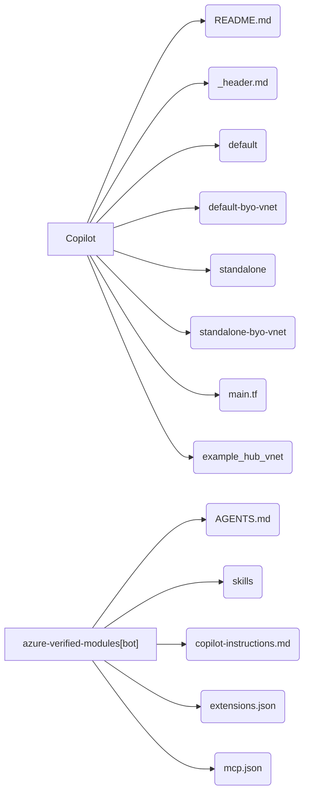

People ↔ code-area edges — `terraform-azurerm-avm-res-network-virtualnetwork`:


People ↔ code-area edges — `terraform-azurerm-avm-res-operationalinsights-workspace`:


---

## Per-member detail

Per-member sections from `view["members"][i]["bundle"]`.

### `Azure/terraform-azurerm-avm-ptn-aiml-landing-zone`

#### Activity at a glance

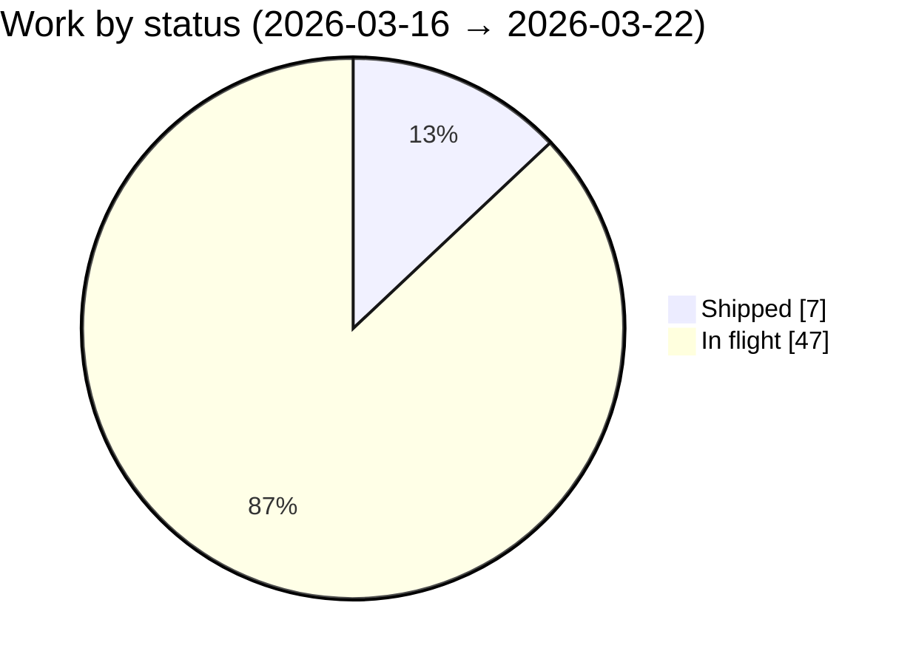

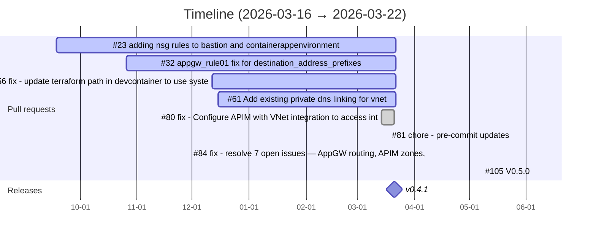

#### Releases

- `v0.4.1` (v0.4.1) — 2026-03-21T06:09:58Z · [release](https://github.com/Azure/terraform-azurerm-avm-ptn-aiml-landing-zone/releases/tag/v0.4.1)

#### CI/CD health

| Workflow | Success | Failure | Cancelled | Total |
|---|---|---|---|---|
| Addressing comment on PR #80 | 14 | 0 | 0 | 14 |
| PR Check | 0 | 15 | 2 | 17 |
| Running Copilot coding agent | 6 | 0 | 1 | 7 |
| devcontainers in /. - Update #1284955580 | 0 | 1 | 0 | 1 |

#### Issue kinds

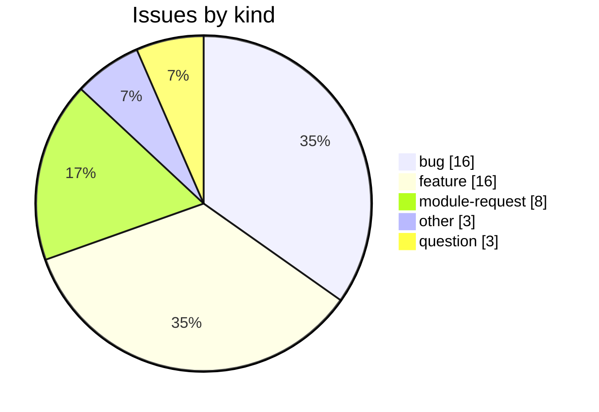

#### In flight — 47 (6 open PRs, 41 open issues)

- [pr#23](https://github.com/Azure/terraform-azurerm-avm-ptn-aiml-landing-zone/pull/23) adding nsg rules to bastion and containerappenvironment subnet — train `train-issue-20`
- [pr#32](https://github.com/Azure/terraform-azurerm-avm-ptn-aiml-landing-zone/pull/32) appgw_rule01 fix for destination_address_prefixes — train `train-issue-35`
- [pr#56](https://github.com/Azure/terraform-azurerm-avm-ptn-aiml-landing-zone/pull/56) fix: update terraform path in devcontainer to use system terraform — train `train-issue-57`
- [pr#61](https://github.com/Azure/terraform-azurerm-avm-ptn-aiml-landing-zone/pull/61) Add existing private dns linking for vnet — train `train-issue-123`
- [pr#84](https://github.com/Azure/terraform-azurerm-avm-ptn-aiml-landing-zone/pull/84) fix: resolve 7 open issues — AppGW routing, APIM zones, VNet peering plan failures, missin — train `train-pr-84`
- [pr#105](https://github.com/Azure/terraform-azurerm-avm-ptn-aiml-landing-zone/pull/105) V0.5.0 — train `train-issue-123`

#### Next-release forecast

- Next milestone: none identified
- Candidates: 0

#### Module dependency graph

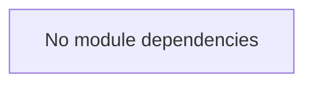

#### Feature changes (add / drop / change)

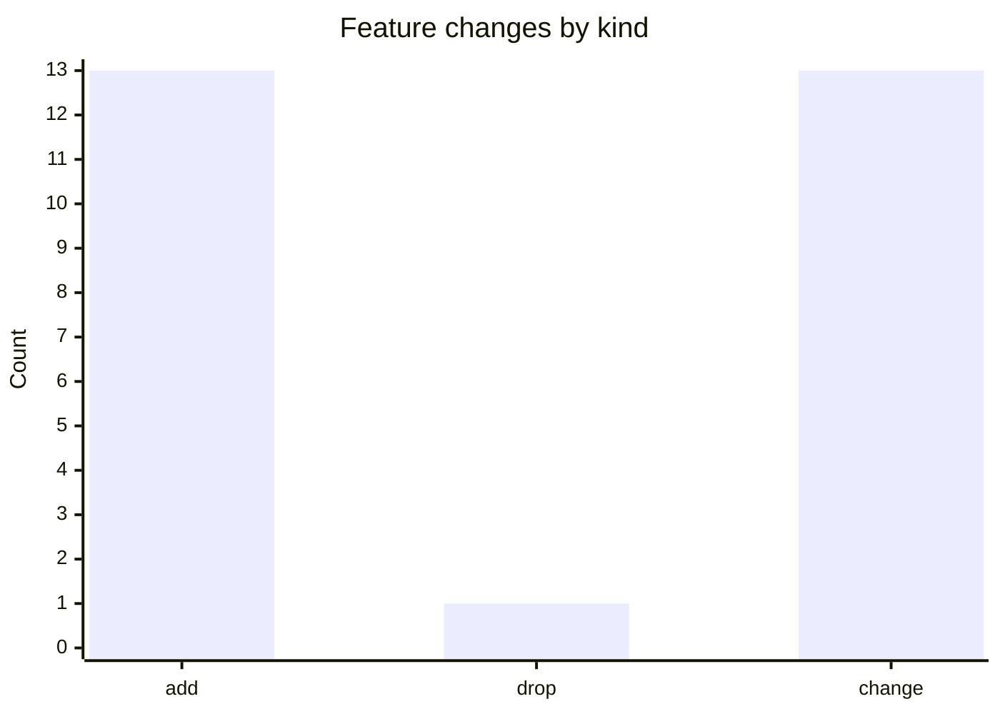

| Kind | Subject | Detail / Name | Author | PR |
|---|---|---|---|---|
| add | doc | AzAPI.md | azure-verified-modules[bot] | #81 |
| add | doc | SKILL.md | azure-verified-modules[bot] | #81 |
| add | doc | terraform-test.md | azure-verified-modules[bot] | #81 |
| add | doc | tfpluginschema.md | azure-verified-modules[bot] | #81 |
| drop | doc | copilot-instructions.md | azure-verified-modules[bot] | #81 |
| change | doc | AGENTS.md | azure-verified-modules[bot] | #81 |
| change | readme | README.md | Copilot | #80 |
| change | doc | _header.md | Copilot | #80 |
| change | readme | README.md | Copilot | #80 |
| change | example | main.tf | Copilot | #80 |
| change | readme | README.md | Copilot | #80 |
| change | example | main.tf | Copilot | #80 |
| change | readme | README.md | Copilot | #80 |
| change | example | main.tf | Copilot | #80 |
| change | readme | README.md | Copilot | #80 |
| change | example | main.tf | Copilot | #80 |
| change | readme | README.md | Copilot | #80 |
| add | comment | terraform comment #name = "ai-lz-vnet-default-2" | Copilot | #80 |
| add | comment | terraform comment #resource_group_name = "ai-lz-rg-default-i | Copilot | #80 |
| add | comment | terraform comment #resource_group_name = "default-example-rg | Copilot | #80 |
| add | comment | terraform comment #resource_group_name = "ai-lz-rg-default-i | Copilot | #80 |
| add | comment | terraform comment #resource_group_name = "default-example-rg | Copilot | #80 |
| change | symbol | terraform module test | Copilot | #80 |
| add | comment | terraform comment #resource_group_name = "ai-lz-rg-default-i | Copilot | #80 |
| add | comment | terraform comment #resource_group_name = "ai-lz-rg-default-i | Copilot | #80 |
| add | symbol | terraform resource time_sleep.wait_for_kv_rbac | Copilot | #80 |
| add | symbol | terraform resource time_sleep.wait_for_kv_rbac | Copilot | #80 |

##### Symbol-level changes

| Detail | Kind | Before | After |
|---|---|---|---|
| terraform comment #name = "ai-lz-vnet-defa | add | `—` | `#name = "ai-lz-vnet-default-2"` |
| terraform comment #resource_group_name = " | add | `—` | `#resource_group_name = "ai-lz-rg-default-ivrhi-2` |
| terraform comment #resource_group_name = " | add | `—` | `#resource_group_name = "default-example-rg-ivrh-` |
| terraform comment #resource_group_name = " | add | `—` | `#resource_group_name = "ai-lz-rg-default-ivrhi-1` |
| terraform comment #resource_group_name = " | add | `—` | `#resource_group_name = "default-example-rg-ivrh-` |
| terraform module test | change | `location            = "swedencentral" #temporari` | `location            = "australiaeast"` |
| terraform comment #resource_group_name = " | add | `—` | `#resource_group_name = "ai-lz-rg-default-ivrhi-4` |
| terraform comment #resource_group_name = " | add | `—` | `#resource_group_name = "ai-lz-rg-default-ivrhi-3` |
| terraform resource time_sleep.wait_for_kv_ | add | `—` | `resource "time_sleep" "wait_for_kv_rbac" {` |
| terraform resource time_sleep.wait_for_kv_ | add | `—` | `resource "time_sleep" "wait_for_kv_rbac" {` |

#### Content lifecycle (built / changed / dropped)

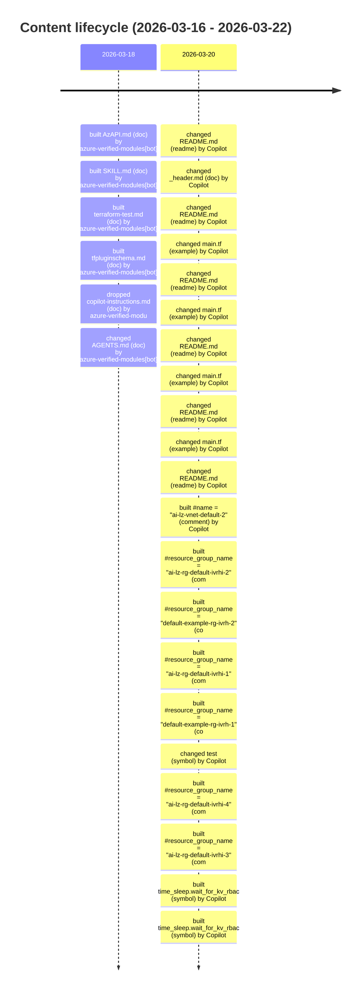

- `copilot-instructions.md` (doc) — removed


### `Azure/terraform-azurerm-avm-res-network-virtualnetwork`

#### Activity at a glance

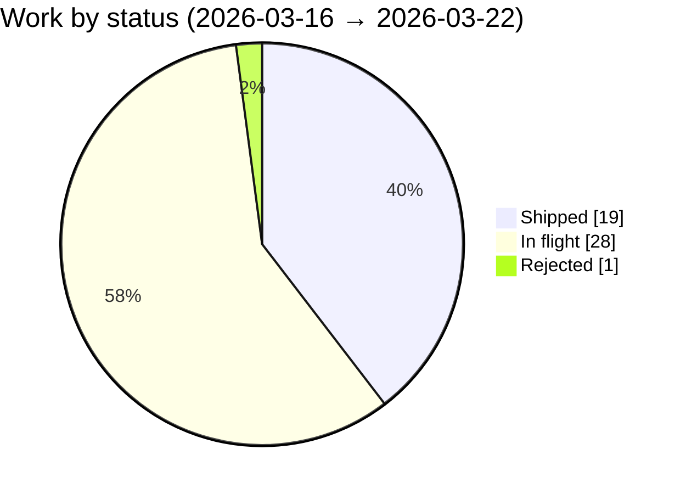

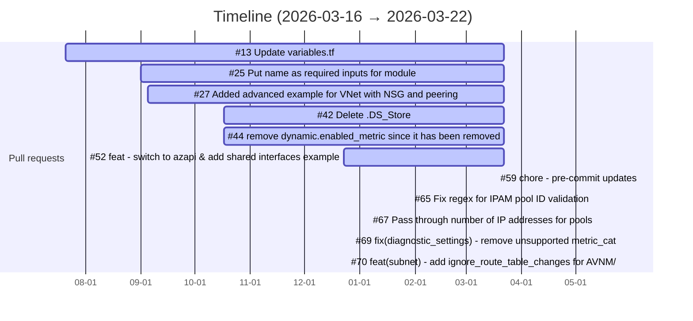

#### CI/CD health

| Workflow | Success | Failure | Cancelled | Total |
|---|---|---|---|---|
| PR Check | 0 | 1 | 0 | 1 |

#### Issue kinds

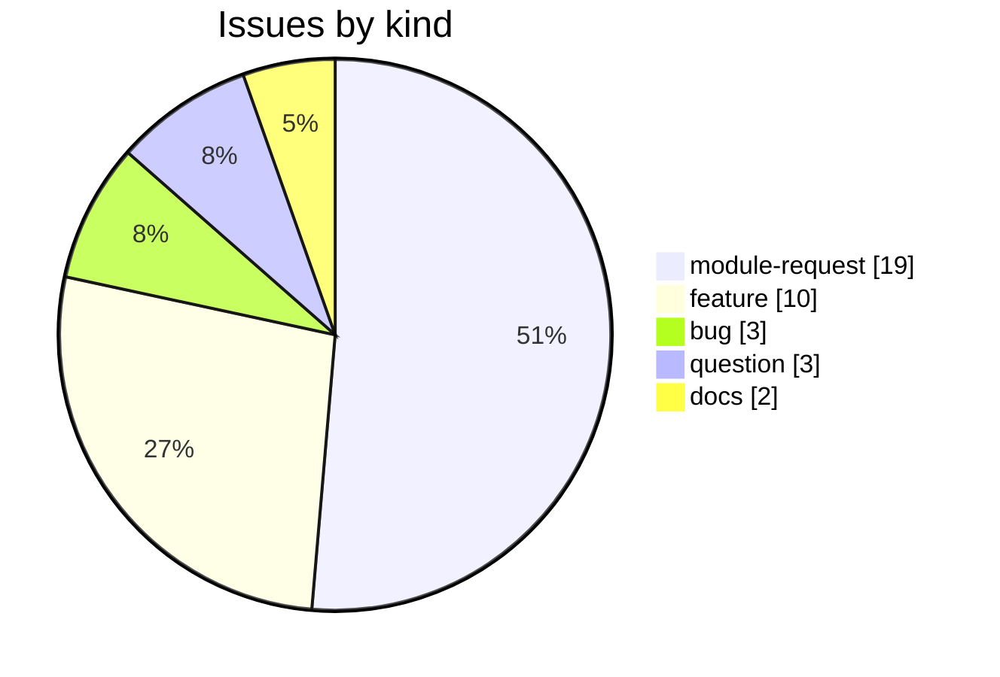

#### In flight — 28 (10 open PRs, 18 open issues)

- [pr#13](https://github.com/Azure/terraform-azurerm-avm-res-network-virtualnetwork/pull/13) Update variables.tf — train `train-issue-12`
- [pr#25](https://github.com/Azure/terraform-azurerm-avm-res-network-virtualnetwork/pull/25) Put name as required inputs for module — train `train-issue-123`
- [pr#27](https://github.com/Azure/terraform-azurerm-avm-res-network-virtualnetwork/pull/27) Added advanced example for VNet with NSG and peering  — train `train-pr-27`
- [pr#42](https://github.com/Azure/terraform-azurerm-avm-res-network-virtualnetwork/pull/42) Delete .DS_Store — train `train-issue-123`
- [pr#44](https://github.com/Azure/terraform-azurerm-avm-res-network-virtualnetwork/pull/44) remove dynamic.enabled_metric since it has been removed in azurerm 4.0 — train `train-issue-43`
- [pr#52](https://github.com/Azure/terraform-azurerm-avm-res-network-virtualnetwork/pull/52) feat: switch to azapi & add shared interfaces example — train `train-pr-52`
- [pr#65](https://github.com/Azure/terraform-azurerm-avm-res-network-virtualnetwork/pull/65) Fix regex for IPAM pool ID validation — train `train-issue-64`
- [pr#67](https://github.com/Azure/terraform-azurerm-avm-res-network-virtualnetwork/pull/67) Pass through number of IP addresses for pools — train `train-issue-123`
- [pr#69](https://github.com/Azure/terraform-azurerm-avm-res-network-virtualnetwork/pull/69) fix(diagnostic_settings): remove unsupported metric_categories for vi… — train `train-pr-69`
- [pr#70](https://github.com/Azure/terraform-azurerm-avm-res-network-virtualnetwork/pull/70)  feat(subnet): add ignore_route_table_changes for AVNM/Policy DINE coexistence — train `train-pr-70`

#### Rejected / abandoned

- [issue#49](https://github.com/Azure/terraform-azurerm-avm-res-network-virtualnetwork/issues/49) [AVM Module Issue]: Why is azapi used for subnet?

#### Next-release forecast

- Next milestone: none identified
- Candidates: 0

#### Module dependency graph

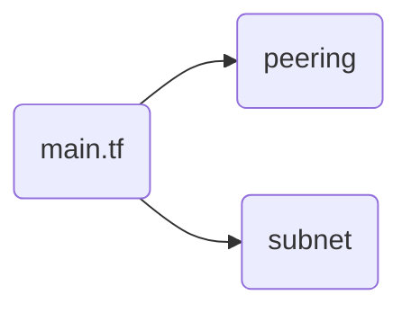

#### Feature changes (add / drop / change)

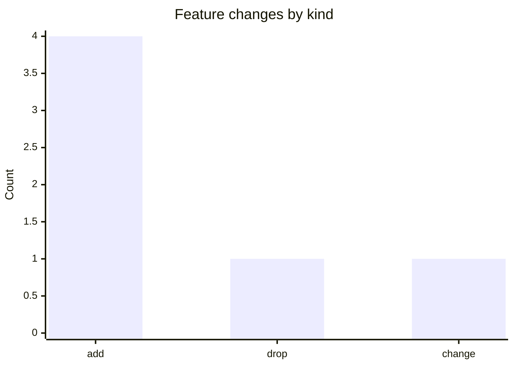

| Kind | Subject | Detail / Name | Author | PR |
|---|---|---|---|---|
| add | doc | AzAPI.md | azure-verified-modules[bot] | #59 |
| add | doc | SKILL.md | azure-verified-modules[bot] | #59 |
| add | doc | terraform-test.md | azure-verified-modules[bot] | #59 |
| add | doc | tfpluginschema.md | azure-verified-modules[bot] | #59 |
| drop | doc | copilot-instructions.md | azure-verified-modules[bot] | #59 |
| change | doc | AGENTS.md | azure-verified-modules[bot] | #59 |

#### Content lifecycle (built / changed / dropped)

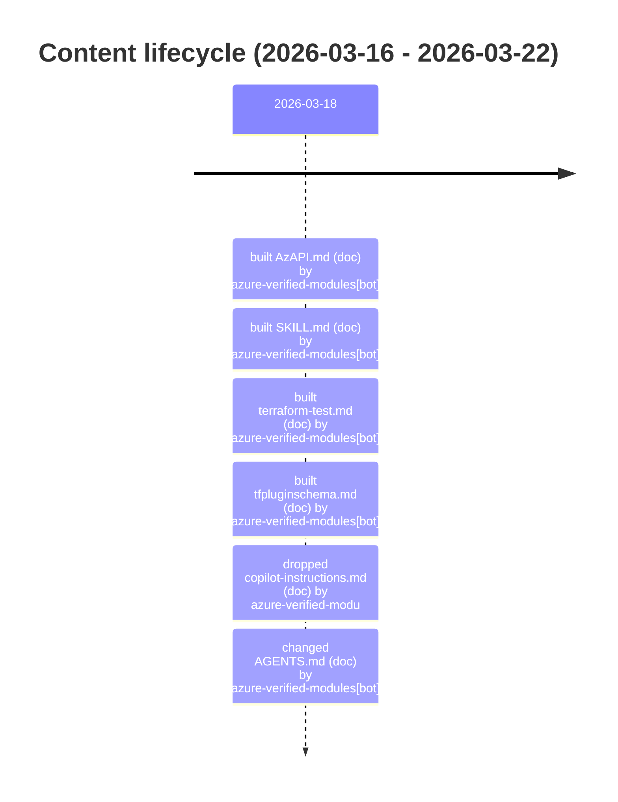

- `copilot-instructions.md` (doc) — removed


### `Azure/terraform-azurerm-avm-res-operationalinsights-workspace`

#### Activity at a glance

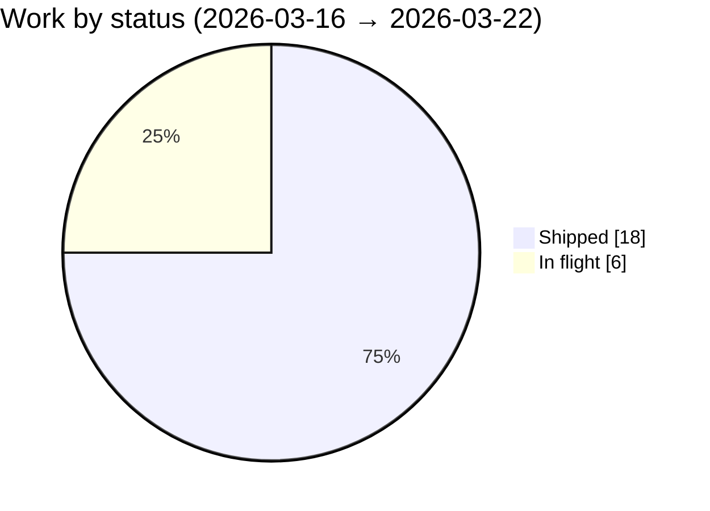

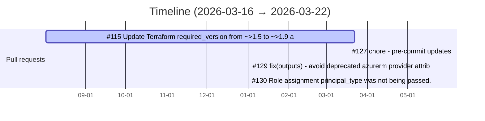

#### CI/CD health

| Workflow | Success | Failure | Cancelled | Total |
|---|---|---|---|---|
| PR Check | 0 | 1 | 0 | 1 |

#### Issue kinds

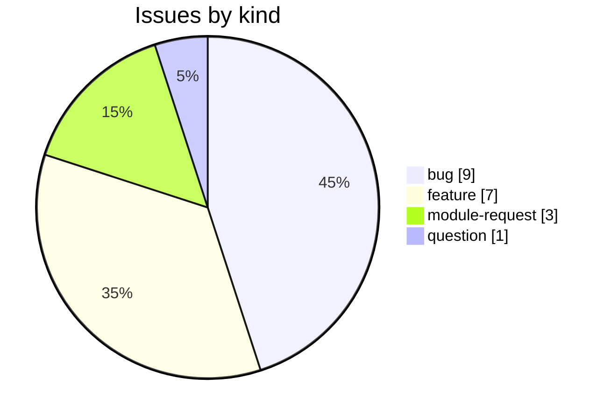

#### In flight — 6 (3 open PRs, 3 open issues)

- [pr#115](https://github.com/Azure/terraform-azurerm-avm-res-operationalinsights-workspace/pull/115) Update Terraform required_version from ~>1.5 to ~>1.9 across all modules and examples — train `train-issue-112`
- [pr#129](https://github.com/Azure/terraform-azurerm-avm-res-operationalinsights-workspace/pull/129) fix(outputs): avoid deprecated azurerm provider attribute in resource… — train `train-issue-128`
- [pr#130](https://github.com/Azure/terraform-azurerm-avm-res-operationalinsights-workspace/pull/130) Role assignment principal_type was not being passed. — train `train-issue-131`

#### Next-release forecast

- Next milestone: none identified
- Candidates: 0

#### Module dependency graph


#### Feature changes (add / drop / change)

```mermaid
xychart-beta
    title "Feature changes by kind"
    x-axis [add, drop, change]
    y-axis "Count" 0 --> 4
    bar [4, 1, 1]
```

| Kind | Subject | Detail / Name | Author | PR |
|---|---|---|---|---|
| add | doc | AzAPI.md | azure-verified-modules[bot] | #127 |
| add | doc | SKILL.md | azure-verified-modules[bot] | #127 |
| add | doc | terraform-test.md | azure-verified-modules[bot] | #127 |
| add | doc | tfpluginschema.md | azure-verified-modules[bot] | #127 |
| drop | doc | copilot-instructions.md | azure-verified-modules[bot] | #127 |
| change | doc | AGENTS.md | azure-verified-modules[bot] | #127 |

#### Content lifecycle (built / changed / dropped)

```mermaid
timeline
    title Content lifecycle (2026-03-16 - 2026-03-22)
    2026-03-18 : built AzAPI.md (doc) by azure-verified-modules[bot] : built SKILL.md (doc) by azure-verified-modules[bot] : built terraform-test.md (doc) by azure-verified-modules[bot] : built tfpluginschema.md (doc) by azure-verified-modules[bot] : dropped copilot-instructions.md (doc) by azure-verified-modu : changed AGENTS.md (doc) by azure-verified-modules[bot]
```

- `copilot-instructions.md` (doc) — removed


---

*Structural rendering of `digest.py` over the project store; 41 diagrams validated with `mmdc`. The JSON bundle (`digest_view.json`) is the source of truth. Re-run: `python3 samples/build_report.py`.*
