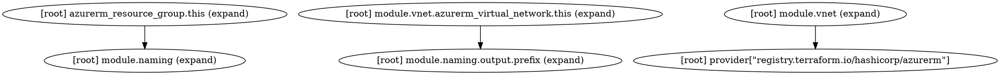

# Activity Overview — Phase 3c Implementation Plan (IaC dependency edges — build-only, full-transitive)

> **For agentic workers:** REQUIRED SUB-SKILL: Use superpowers:subagent-driven-development (recommended) or superpowers:executing-plans to implement this plan task-by-task. Steps use checkbox (`- [ ]`) syntax for tracking.

**Goal:** Populate `code_graph.areas[].edges` with **inter-area dependency edges** resolved by the real IaC toolchain — **Bicep** via `bicep restore`+`bicep build`→ARM (full transitive nested-deployment walk, joined with source-ref parsing for the `br/public:…:<version>` identity) and **Terraform** via `terraform init -backend=false`+`terraform graph` — emitted **build-only** (left empty when the CLI/registry is unavailable, never best-effort static text), then surfaced in a `module_graph` diagram, the report, the docs, and the live gate.

**Architecture:** Unchanged three-offline-layers-over-one-network/git-layer shape. `gather.py` grows pure, fixture-tested helpers — `parse_bicep_module_refs`, `walk_arm_deployments`, `resolve_module_ref`, `build_bicep_edges`, `parse_terraform_module_blocks`, `parse_terraform_graph`, `build_terraform_edges` — plus a **build-only orchestration seam** `extract_iac_edges(code_graph, clone_dir, which, run, read_text)` (injectable `which`/`run`/`read_text` so it is exercised offline without the CLIs). `acquire()` calls it right after `select_code_area_provider`. `render.py` gains `emit_module_graph`. The Bicep edges **light up on the live gate** (the runner installs `bicep`); Terraform is **fixture-validated** (the test repo has no `.tf`) but the `terraform graph` path is real and the gate installs `terraform` too.

**Tech Stack:** Python 3.11 stdlib only (`json`, `re`, `os`, `shutil`, `subprocess`, `unittest`). New **required external CLIs for the edge gate**: `bicep` (single binary from the Azure/bicep GitHub release) and `terraform` (HashiCorp release). `git`, `mmdc` unchanged. No third-party Python packages.

**Spec:** `docs/superpowers/specs/2026-06-01-activity-overview-design.md` — rev-9 "Dependency edges (Phase 3c, rev 9)" gather-component bullet, the non-goals dependency-edge paragraph, the Phase 3c phasing bullet, and the bundle schema `code_graph.areas[].edges:[{to,kind,ref,version,transitive,provider,resolved}]`.

**Working directory:** `.claude/skills/activity-overview/`. Run all `python3`/`pytest` commands from there (the suite does `sys.path.insert` the skill dir and reads `fixtures/`).

**Branch:** `claude/install-superpowers-skill-1Dibe` (already created). All commits local; the only push is the final task.

---

## LOCKED SCOPE & explicit deferrals

Phase 3c is the **IaC dependency-edge** slice. In scope: Bicep edges (`bicep build`→ARM, build-only, full-transitive tree walk, immediate edges fully identified from source), Terraform edges (`terraform graph`, build-only), the `module_graph` diagram, the report subsection, the docs, the CI/setup install of `bicep`+`terraform`, and the gate flip from `edges == []` to the edge contract.

Explicit deferrals — the schema reserves their place; 3c leaves them out and documents why:

- **Symbol-granular / inline-comment artifacts** — still file-granularity (Phase 3a/3b carryover). `artifacts[].kind` stays `readme|doc|example`. **Deferred to Phase 3d.**
- **Symbol-identity tracking across renames/moves** — **Deferred to Phase 3e.**
- **`hunk`/`before`/`after`/`detail` on feature_deltas** — still null (Phase 3a deferral, unchanged).
- **Resource-level (`dependsOn`) intra-module edges as a separate graph** — 3c records `kind:"module"` inter-area edges only. `dependsOn` is read during the ARM walk solely to establish the nested-deployment parent/child structure, not emitted as resource edges. **Deferred (belongs with 3d symbol/resource graph).**
- **Deep external-module identity** — the ARM tree is walked in full (transitive), but deep nodes that are **not also areas in this repo** are not fabricated into edges (external AVM modules are versioned/immutable; their internal structure is not this repo's area graph). Transitive edges connect repo areas to repo areas. Documented, not a shortcut.
- **Multi-repo aggregation** — single repo (Phase 6).

---

## Edge object (the contract every task targets)

Each entry in `code_graph.areas[].edges`:

```json
{
  "to": "avm/res/storage/storage-account" ,   // canonical target area-id, or null if unresolvable
  "kind": "module",                            // inter-area module dependency (resource edges deferred)
  "ref": "br/public:avm/res/storage/storage-account:0.9.0",  // raw bicep/tf reference text
  "version": "0.9.0",                          // pinned version when present, else null
  "transitive": false,                         // false = direct source ref; true = deeper in the build tree
  "provider": "bicep",                         // "bicep" | "terraform"
  "resolved": true                             // to is not null
}
```

**Build-only invariant:** an area's `edges` is non-empty **only** after a successful `bicep build` / `terraform graph` for that area. Any toolchain absence, restore failure, or build error leaves `edges == []` (exactly as Phase 3b left it). No static-text fallback ever writes edges.

---

## File Structure

All paths under `.claude/skills/activity-overview/`.

- **Modify `gather.py`** — add the pure helpers + the `extract_iac_edges` seam (after `select_code_area_provider`, before `parse_codeowners`); call `extract_iac_edges` in `acquire()` right after `code_graph = select_code_area_provider(...)`.
- **Modify `render.py`** — add `emit_module_graph`; register it in `render()` (manifest gains `module_graph`).
- **Modify `test_gather.py`, `test_render.py`** — add Phase 3c test classes only; touch no existing assertion.
- **Create fixtures:** `fixtures/bicep_source_sample.bicep`, `fixtures/arm_compiled_sample.json`, `fixtures/terraform_source_sample.tf`, `fixtures/terraform_graph_sample.dot`, `fixtures/bundle_p3c.json`.
- **Modify docs:** `BUNDLE.md` (document the edge object + build-only semantics + deferrals), `SKILL.md` (preflight note that `bicep`/`terraform` enable edges; absent → edges empty), `report-template.md` (a "Module dependency graph / blast radius" subsection under §3 embedding `module_graph`).
- **Modify `.github/workflows/activity-overview-integration.yml`** — install `bicep`+`terraform`; flip the `edges == []` assertion to the edge contract; run green on real Bicep data.
- **Modify `.github/workflows/activity-overview-tests.yml`** — no tool install needed (the edge helpers are fixture-tested offline); only confirm the new tests run under the existing discover step (no change required — verify only).

**Backward-compatibility rule (every task):** Phases 1/2/3a/3b tests stay green. Do **not** mutate any existing fixture or existing assertion. **One justified exception (Task 9 / Task 11):** the render manifest assertions and the integration `edges == []` assertion legitimately change — the manifest grows by one key (`module_graph`) and edges may now be non-empty. Update exactly those. All new logic degrades permissively: an area with no recognized entrypoint, or a missing toolchain, keeps `edges: []`, so every Phase 3b fixture/assertion still passes unchanged.

---

## Task 1: Phase 3c fixtures (bicep source, compiled ARM, terraform source, terraform graph)

Recorded inputs the pure helpers parse. Hand-authored from the real formats; the live gate (Task 11) validates the parsers against real `bicep build` / `terraform graph` output and any field drift is corrected there.

**Files:**
- Create: `fixtures/bicep_source_sample.bicep`
- Create: `fixtures/arm_compiled_sample.json`
- Create: `fixtures/terraform_source_sample.tf`
- Create: `fixtures/terraform_graph_sample.dot`

- [ ] **Step 1: Create `fixtures/bicep_source_sample.bicep`**

A pattern-module entrypoint that references two registry modules (one of which — `key-vault/vault` — is also present as a repo area, to exercise the transitive match) and one local module:

```bicep
metadata name = 'Example Pattern Module'
metadata description = 'Fixture entrypoint for Phase 3c edge extraction.'

@description('Required. Name prefix.')
param name string

module storageAccount 'br/public:avm/res/storage/storage-account:0.9.0' = {
  name: 'storageDeployment'
  params: {
    name: '${name}stg'
  }
}

module keyVault 'br/public:avm/res/key-vault/vault:0.6.1' = {
  name: 'kvDeployment'
  params: {
    name: '${name}kv'
  }
}

module shared '../../../utl/types/avm-common-types/main.bicep' = {
  name: 'sharedDeployment'
}
```

- [ ] **Step 2: Create `fixtures/arm_compiled_sample.json`**

A compiled-ARM shape with the **full transitive** nested-deployment tree (`storageDeployment` itself nests a telemetry deployment; `kvDeployment` is a leaf whose inner `metadata.name` matches the repo area tail `vault`):

```json
{
  "$schema": "https://schema.management.azure.com/schemas/2019-04-01/deploymentTemplate.json#",
  "metadata": { "_generator": { "name": "bicep", "version": "0.30.23" }, "name": "Example Pattern Module" },
  "parameters": { "name": { "type": "string" } },
  "resources": [
    {
      "type": "Microsoft.Resources/deployments",
      "apiVersion": "2022-09-01",
      "name": "storageDeployment",
      "properties": {
        "expressionEvaluationOptions": { "scope": "inner" },
        "mode": "Incremental",
        "template": {
          "metadata": { "name": "storage-account", "_generator": { "name": "bicep" } },
          "resources": [
            { "type": "Microsoft.Storage/storageAccounts", "apiVersion": "2023-01-01", "name": "[parameters('name')]" },
            {
              "type": "Microsoft.Resources/deployments",
              "apiVersion": "2022-09-01",
              "name": "46d3xbcp.res.storage-storageaccount.0-9-0.abcde",
              "properties": { "mode": "Incremental", "template": { "metadata": { "name": "storage-account" }, "resources": [] } }
            }
          ]
        }
      }
    },
    {
      "type": "Microsoft.Resources/deployments",
      "apiVersion": "2022-09-01",
      "name": "kvDeployment",
      "properties": {
        "expressionEvaluationOptions": { "scope": "inner" },
        "mode": "Incremental",
        "template": { "metadata": { "name": "vault", "_generator": { "name": "bicep" } }, "resources": [] }
      }
    }
  ]
}
```

- [ ] **Step 3: Create `fixtures/terraform_source_sample.tf`**

A root module that calls two child modules — one local, one registry:

```hcl
module "vnet" {
  source = "../../modules/vnet"
}

module "naming" {
  source  = "Azure/naming/azurerm"
  version = "0.4.0"
}

resource "azurerm_resource_group" "this" {
  name     = "example"
  location = "eastus"
}
```

- [ ] **Step 4: Create `fixtures/terraform_graph_sample.dot`**

Representative `terraform graph` output (root depends on `module.vnet` and `module.naming`; `module.vnet` depends on `module.naming`):



- [ ] **Step 5: Verify the fixtures parse as text/JSON**

Run:
```bash
cd .claude/skills/activity-overview
python3 -c "import json; json.load(open('fixtures/arm_compiled_sample.json')); print('arm ok')"
python3 -c "print('bicep refs:', open('fixtures/bicep_source_sample.bicep').read().count('module '))"
python3 -c "print('dot edges:', open('fixtures/terraform_graph_sample.dot').read().count('->'))"
```
Expected: `arm ok`, `bicep refs: 3`, `dot edges: 3`.

- [ ] **Step 6: Commit**

```bash
git add fixtures/bicep_source_sample.bicep fixtures/arm_compiled_sample.json fixtures/terraform_source_sample.tf fixtures/terraform_graph_sample.dot
git commit -m "$(cat <<'EOF'
test(activity): phase 3c fixtures (bicep source, compiled ARM, terraform source + graph)

https://claude.ai/code/session_01NUzaWbTrTnYbxCUEJ36Byb
EOF
)"
```

---

## Task 2: Pure Bicep source-ref parser

`parse_bicep_module_refs(source_text)` extracts every `module <sym> '<ref>'` reference from a `.bicep` source, splitting each into a registry path + version (for `br/public:…` / `br:…`) or a local path. These are the **immediate, fully-identified** edges.

**Files:**
- Modify: `gather.py` (add after `select_code_area_provider`)
- Test: `test_gather.py`

- [ ] **Step 1: Write the failing test**

Add to `test_gather.py`:

```python
class TestParseBicepModuleRefs(unittest.TestCase):
    def setUp(self):
        with open(os.path.join(FIX, "bicep_source_sample.bicep")) as fh:
            self.src = fh.read()

    def test_extracts_all_three_module_refs(self):
        refs = gather.parse_bicep_module_refs(self.src)
        self.assertEqual(len(refs), 3)

    def test_registry_ref_splits_path_and_version(self):
        refs = gather.parse_bicep_module_refs(self.src)
        by_path = {r["registry_path"]: r for r in refs if r["registry_path"]}
        self.assertIn("avm/res/storage/storage-account", by_path)
        self.assertEqual(by_path["avm/res/storage/storage-account"]["version"], "0.9.0")
        self.assertEqual(by_path["avm/res/key-vault/vault"]["version"], "0.6.1")
        self.assertIsNone(by_path["avm/res/storage/storage-account"]["local_path"])

    def test_local_ref_is_kept_as_local_path(self):
        refs = gather.parse_bicep_module_refs(self.src)
        locals_ = [r for r in refs if r["local_path"]]
        self.assertEqual(len(locals_), 1)
        self.assertEqual(locals_[0]["local_path"],
                         "../../../utl/types/avm-common-types/main.bicep")
        self.assertIsNone(locals_[0]["registry_path"])

    def test_br_with_explicit_registry_host_strips_to_path(self):
        src = "module x 'br:mcr.microsoft.com/bicep/avm/res/network/vnet:1.2.3' = {}"
        r = gather.parse_bicep_module_refs(src)[0]
        self.assertEqual(r["registry_path"], "avm/res/network/vnet")
        self.assertEqual(r["version"], "1.2.3")

    def test_empty_or_none_source_yields_no_refs(self):
        self.assertEqual(gather.parse_bicep_module_refs(""), [])
        self.assertEqual(gather.parse_bicep_module_refs(None), [])
```

- [ ] **Step 2: Run test to verify it fails**

Run: `python3 -m pytest test_gather.py -k "ParseBicepModuleRefs" -v`
Expected: FAIL with `AttributeError: module 'gather' has no attribute 'parse_bicep_module_refs'`.

- [ ] **Step 3: Implement the parser**

Add to `gather.py` after `select_code_area_provider`:

```python
# Phase 3c: IaC dependency-edge extraction (build-only). The edge object is
# {to, kind, ref, version, transitive, provider, resolved}; see BUNDLE.md.

_BICEP_MODULE_RE = re.compile(r"module\s+\w+\s+'(?P<ref>[^']+)'")


def parse_bicep_module_refs(source_text):
    """Extract `module <sym> '<ref>'` references from a .bicep source.

    Each result is {ref, registry_path, version, local_path}. Registry refs
    (`br/public:<path>:<ver>` or `br:<host>/bicep/<path>:<ver>`) split into
    `registry_path` + `version`; everything else is a `local_path`. Pure."""
    refs = []
    for m in _BICEP_MODULE_RE.finditer(source_text or ""):
        ref = m.group("ref")
        registry_path = version = local_path = None
        if ref.startswith("br/public:") or ref.startswith("br:"):
            body = ref.split(":", 1)[1]              # drop the br/public or br scheme
            if ":" in body:
                path_part, version = body.rsplit(":", 1)
            else:
                path_part = body
            if "/bicep/" in path_part:               # strip an explicit registry host
                path_part = path_part.split("/bicep/", 1)[1]
            registry_path = path_part
        else:
            local_path = ref
        refs.append({"ref": ref, "registry_path": registry_path,
                     "version": version, "local_path": local_path})
    return refs
```

- [ ] **Step 4: Run test to verify it passes**

Run: `python3 -m pytest test_gather.py -k "ParseBicepModuleRefs" -v`
Expected: PASS (5 tests).

- [ ] **Step 5: Commit**

```bash
git add gather.py test_gather.py
git commit -m "$(cat <<'EOF'
feat(activity): parse bicep module references (registry path + version, local)

https://claude.ai/code/session_01NUzaWbTrTnYbxCUEJ36Byb
EOF
)"
```

---

## Task 3: Pure module-ref → area-id resolver

`resolve_module_ref(ref_info, base_path, patterns)` maps a parsed ref to a canonical area-id, reusing the Phase 3b `classify_code_area` so registry/local Bicep refs collapse to the same `avm/res/<svc>/<module>` ids the directory provider produces.

**Files:**
- Modify: `gather.py` (add after `parse_bicep_module_refs`)
- Test: `test_gather.py`

- [ ] **Step 1: Write the failing test**

Add to `test_gather.py`:

```python
class TestResolveModuleRef(unittest.TestCase):
    def test_registry_path_resolves_to_avm_area_id(self):
        ri = {"registry_path": "avm/res/storage/storage-account",
              "version": "0.9.0", "local_path": None}
        self.assertEqual(
            gather.resolve_module_ref(ri, "avm/ptn/foo/bar/main.bicep",
                                      gather.DEFAULT_AREA_PATTERNS),
            "avm/res/storage/storage-account")

    def test_local_ref_resolves_relative_to_base(self):
        ri = {"registry_path": None, "version": None,
              "local_path": "../../../utl/types/avm-common-types/main.bicep"}
        # base dir avm/ptn/foo/bar -> up three (file-relative) -> avm/utl/types/...
        self.assertEqual(
            gather.resolve_module_ref(ri, "avm/ptn/foo/bar/main.bicep",
                                      gather.DEFAULT_AREA_PATTERNS),
            "avm/utl/types/avm-common-types")

    def test_unrecognised_registry_path_falls_back_to_the_path(self):
        ri = {"registry_path": "some/custom/thing", "version": "1.0.0",
              "local_path": None}
        self.assertEqual(
            gather.resolve_module_ref(ri, "x/main.bicep",
                                      gather.DEFAULT_AREA_PATTERNS),
            "some/custom/thing")

    def test_empty_ref_resolves_to_none(self):
        self.assertIsNone(
            gather.resolve_module_ref({"registry_path": None, "version": None,
                                       "local_path": None}, "x/main.bicep",
                                      gather.DEFAULT_AREA_PATTERNS))
```

- [ ] **Step 2: Run test to verify it fails**

Run: `python3 -m pytest test_gather.py -k "ResolveModuleRef" -v`
Expected: FAIL with `AttributeError: module 'gather' has no attribute 'resolve_module_ref'`.

- [ ] **Step 3: Implement the resolver**

Add to `gather.py` after `parse_bicep_module_refs`:

```python
def resolve_module_ref(ref_info, base_path, patterns=None):
    """Map a parsed bicep/tf ref to a canonical area-id (reusing classify_code_area).

    Registry refs classify their `<path>/main.bicep`; local refs are normalised
    relative to `base_path`'s directory then classified. Returns the area-id, or
    the raw path when classification declines, or None when nothing is set. Pure."""
    patterns = patterns or DEFAULT_AREA_PATTERNS
    rp = ref_info.get("registry_path")
    if rp:
        probe = rp.rstrip("/") + "/main.bicep"
        return classify_code_area(probe, patterns) or rp
    lp = ref_info.get("local_path")
    if lp:
        base_dir = os.path.dirname(base_path or "")
        joined = os.path.normpath(os.path.join(base_dir, lp))
        return classify_code_area(joined, patterns) or os.path.dirname(joined) or joined
    return None
```

- [ ] **Step 4: Run test to verify it passes**

Run: `python3 -m pytest test_gather.py -k "ResolveModuleRef" -v`
Expected: PASS (4 tests).

- [ ] **Step 5: Commit**

```bash
git add gather.py test_gather.py
git commit -m "$(cat <<'EOF'
feat(activity): resolve bicep/tf module refs to canonical area-ids

https://claude.ai/code/session_01NUzaWbTrTnYbxCUEJ36Byb
EOF
)"
```

---

## Task 4: Pure ARM nested-deployment walker

`walk_arm_deployments(arm_json)` recurses the **full transitive** tree of `Microsoft.Resources/deployments` resources, yielding each node with its depth, the inner template's `metadata.name`, and the deployment `name` (for telemetry-based identity hints). This proves the build resolved and supplies the transitive structure.

**Files:**
- Modify: `gather.py` (add after `resolve_module_ref`)
- Test: `test_gather.py`

- [ ] **Step 1: Write the failing test**

Add to `test_gather.py`:

```python
class TestWalkArmDeployments(unittest.TestCase):
    def setUp(self):
        with open(os.path.join(FIX, "arm_compiled_sample.json")) as fh:
            self.arm = json.load(fh)

    def test_walks_full_transitive_tree(self):
        nodes = gather.walk_arm_deployments(self.arm)
        # storageDeployment (d1) + its nested telemetry (d2) + kvDeployment (d1) = 3
        self.assertEqual(len(nodes), 3)

    def test_records_depth_and_metadata_name(self):
        nodes = gather.walk_arm_deployments(self.arm)
        by_name = {n["name"]: n for n in nodes}
        self.assertEqual(by_name["storageDeployment"]["depth"], 1)
        self.assertEqual(by_name["storageDeployment"]["metadata_name"], "storage-account")
        self.assertEqual(by_name["kvDeployment"]["metadata_name"], "vault")
        # the telemetry deployment is one level deeper
        self.assertEqual(
            by_name["46d3xbcp.res.storage-storageaccount.0-9-0.abcde"]["depth"], 2)

    def test_handles_resources_as_dict_symbolic_names(self):
        arm = {"resources": {
            "dep": {"type": "Microsoft.Resources/deployments", "name": "d",
                    "properties": {"template": {"metadata": {"name": "x"},
                                                "resources": []}}}}}
        self.assertEqual(len(gather.walk_arm_deployments(arm)), 1)

    def test_empty_or_none_arm_yields_nothing(self):
        self.assertEqual(gather.walk_arm_deployments({}), [])
        self.assertEqual(gather.walk_arm_deployments(None), [])
```

- [ ] **Step 2: Run test to verify it fails**

Run: `python3 -m pytest test_gather.py -k "WalkArmDeployments" -v`
Expected: FAIL with `AttributeError: module 'gather' has no attribute 'walk_arm_deployments'`.

- [ ] **Step 3: Implement the walker**

Add to `gather.py` after `resolve_module_ref`:

```python
def _arm_resources(template):
    """ARM `resources` may be a list or (symbolic-name) dict; normalise to a list."""
    res = (template or {}).get("resources", [])
    return list(res.values()) if isinstance(res, dict) else (res or [])


def walk_arm_deployments(arm_json):
    """Yield every Microsoft.Resources/deployments node in the full transitive tree.

    Each node is {name, depth, metadata_name, depends_on}. `depth` is 1 for a
    top-level module instantiation and increments per nesting level. `metadata_name`
    is the inner template's `metadata.name` (a short module name, best-effort
    identity hint). Pure."""
    nodes = []

    def visit(template, depth):
        for res in _arm_resources(template):
            if not isinstance(res, dict):
                continue
            if res.get("type") == "Microsoft.Resources/deployments":
                inner = (res.get("properties") or {}).get("template") or {}
                nodes.append({
                    "name": res.get("name"),
                    "depth": depth + 1,
                    "metadata_name": (inner.get("metadata") or {}).get("name"),
                    "depends_on": res.get("dependsOn", []),
                })
                visit(inner, depth + 1)

    visit(arm_json or {}, 0)
    return nodes
```

- [ ] **Step 4: Run test to verify it passes**

Run: `python3 -m pytest test_gather.py -k "WalkArmDeployments" -v`
Expected: PASS (4 tests).

- [ ] **Step 5: Commit**

```bash
git add gather.py test_gather.py
git commit -m "$(cat <<'EOF'
feat(activity): walk the full transitive ARM nested-deployment tree

https://claude.ai/code/session_01NUzaWbTrTnYbxCUEJ36Byb
EOF
)"
```

---

## Task 5: Bicep edge builder (immediate authoritative + transitive repo-area best-effort)

`build_bicep_edges(source_text, arm_json, base_path, area_ids, patterns)` combines Tasks 2-4: immediate edges from the **source** (fully identified, `transitive=False`), plus transitive edges from the **ARM tree** whose `metadata.name` confidently matches another **area in this repo** (`transitive=True`). Deep external-only nodes are not fabricated into edges.

**Files:**
- Modify: `gather.py` (add after `walk_arm_deployments`)
- Test: `test_gather.py`

- [ ] **Step 1: Write the failing test**

Add to `test_gather.py`:

```python
class TestBuildBicepEdges(unittest.TestCase):
    def setUp(self):
        with open(os.path.join(FIX, "bicep_source_sample.bicep")) as fh:
            self.src = fh.read()
        with open(os.path.join(FIX, "arm_compiled_sample.json")) as fh:
            self.arm = json.load(fh)
        # key-vault/vault is ALSO a repo area -> exercises transitive repo-area match
        self.area_ids = {"avm/ptn/foo/bar", "avm/res/key-vault/vault"}
        self.base = "avm/ptn/foo/bar/main.bicep"

    def test_immediate_edges_carry_area_id_and_version(self):
        edges = gather.build_bicep_edges(self.src, self.arm, self.base,
                                         self.area_ids, gather.DEFAULT_AREA_PATTERNS)
        imm = {e["to"]: e for e in edges if not e["transitive"]}
        self.assertEqual(imm["avm/res/storage/storage-account"]["version"], "0.9.0")
        self.assertEqual(imm["avm/res/storage/storage-account"]["provider"], "bicep")
        self.assertTrue(imm["avm/res/storage/storage-account"]["resolved"])
        self.assertEqual(imm["avm/res/key-vault/vault"]["version"], "0.6.1")
        # the local ref resolved to its utl area
        self.assertIn("avm/utl/types/avm-common-types", imm)

    def test_all_three_source_refs_become_immediate_edges(self):
        edges = gather.build_bicep_edges(self.src, self.arm, self.base,
                                         self.area_ids, gather.DEFAULT_AREA_PATTERNS)
        self.assertEqual(sum(1 for e in edges if not e["transitive"]), 3)

    def test_transitive_edge_only_for_repo_areas(self):
        edges = gather.build_bicep_edges(self.src, self.arm, self.base,
                                         self.area_ids, gather.DEFAULT_AREA_PATTERNS)
        trans = {e["to"] for e in edges if e["transitive"]}
        # vault is a repo area -> its nested deployment yields a transitive edge;
        # storage-account is NOT in area_ids here -> no phantom transitive edge.
        self.assertIn("avm/res/key-vault/vault", trans)
        self.assertNotIn(None, trans)

    def test_empty_build_inputs_yield_no_edges(self):
        self.assertEqual(
            gather.build_bicep_edges("", {}, self.base, set(),
                                     gather.DEFAULT_AREA_PATTERNS), [])
```

- [ ] **Step 2: Run test to verify it fails**

Run: `python3 -m pytest test_gather.py -k "BuildBicepEdges" -v`
Expected: FAIL with `AttributeError: module 'gather' has no attribute 'build_bicep_edges'`.

- [ ] **Step 3: Implement the builder**

Add to `gather.py` after `walk_arm_deployments`:

```python
def _normalize_id(text):
    """Lowercase + strip separators, for lenient identity matching."""
    return re.sub(r"[^a-z0-9]", "", (text or "").lower())


def _match_repo_area(name, area_ids):
    """Find the area-id in `area_ids` whose tail confidently matches `name`.

    Lenient normalised comparison (the ARM `metadata.name` is a short module name
    like `vault`; the area tail is `vault`/`key-vault`). Returns the area-id or None."""
    target = _normalize_id(name)
    if not target:
        return None
    for aid in area_ids:
        tail = aid.rstrip("/").split("/")[-1]
        nt = _normalize_id(tail)
        if nt and (nt == target or nt in target or target in nt):
            return aid
    return None


def build_bicep_edges(source_text, arm_json, base_path, area_ids, patterns=None):
    """Build inter-area dependency edges for one Bicep area.

    Immediate edges (transitive=False) come from the SOURCE refs — fully identified
    (area-id + version), build-validated by the caller. Transitive edges
    (transitive=True) come from the ARM tree but only when a nested deployment's
    `metadata.name` confidently matches ANOTHER area in this repo (no fabricated
    external ids). Pure; deterministic (deduped, then sorted)."""
    patterns = patterns or DEFAULT_AREA_PATTERNS
    edges = []
    seen = set()

    for ri in parse_bicep_module_refs(source_text):
        to = resolve_module_ref(ri, base_path, patterns)
        key = (to, ri["ref"], False)
        if key in seen:
            continue
        seen.add(key)
        edges.append({"to": to, "kind": "module", "ref": ri["ref"],
                      "version": ri["version"], "transitive": False,
                      "provider": "bicep", "resolved": to is not None})

    self_id = classify_code_area(base_path, patterns)
    for node in walk_arm_deployments(arm_json):
        if node["depth"] < 1:
            continue
        to = _match_repo_area(node.get("metadata_name"), area_ids)
        if to is None or to == self_id:
            continue
        key = (to, node.get("name"), True)
        if key in seen:
            continue
        seen.add(key)
        edges.append({"to": to, "kind": "module", "ref": node.get("name"),
                      "version": None, "transitive": True,
                      "provider": "bicep", "resolved": True})

    return sorted(edges, key=lambda e: (e["transitive"], str(e["to"]), str(e["ref"])))
```

- [ ] **Step 4: Run test to verify it passes**

Run: `python3 -m pytest test_gather.py -k "BuildBicepEdges" -v`
Expected: PASS (4 tests).

- [ ] **Step 5: Commit**

```bash
git add gather.py test_gather.py
git commit -m "$(cat <<'EOF'
feat(activity): build bicep area edges (immediate from source + transitive repo-area)

https://claude.ai/code/session_01NUzaWbTrTnYbxCUEJ36Byb
EOF
)"
```

---

## Task 6: Pure Terraform parsers (module blocks + graph DOT)

`parse_terraform_module_blocks(tf_text)` maps each `module "<name>" { source = "..." }` to its source; `parse_terraform_graph(dot_text)` extracts module→module dependency pairs from `terraform graph` DOT output.

**Files:**
- Modify: `gather.py` (add after `build_bicep_edges`)
- Test: `test_gather.py`

- [ ] **Step 1: Write the failing test**

Add to `test_gather.py`:

```python
class TestTerraformParsers(unittest.TestCase):
    def setUp(self):
        with open(os.path.join(FIX, "terraform_source_sample.tf")) as fh:
            self.tf = fh.read()
        with open(os.path.join(FIX, "terraform_graph_sample.dot")) as fh:
            self.dot = fh.read()

    def test_module_blocks_map_name_to_source(self):
        blocks = gather.parse_terraform_module_blocks(self.tf)
        self.assertEqual(blocks["vnet"], "../../modules/vnet")
        self.assertEqual(blocks["naming"], "Azure/naming/azurerm")
        self.assertNotIn("azurerm_resource_group", blocks)  # resources are not modules

    def test_graph_yields_module_dependency_pairs(self):
        pairs = gather.parse_terraform_graph(self.dot)
        # root (None) -> naming ; vnet -> naming
        self.assertIn((None, "naming"), pairs)
        self.assertIn(("vnet", "naming"), pairs)

    def test_graph_ignores_same_module_self_edges(self):
        pairs = gather.parse_terraform_graph(self.dot)
        self.assertFalse([p for p in pairs if p[0] == p[1] and p[0] is not None])

    def test_empty_inputs(self):
        self.assertEqual(gather.parse_terraform_module_blocks(""), {})
        self.assertEqual(gather.parse_terraform_graph(""), [])
        self.assertEqual(gather.parse_terraform_module_blocks(None), {})
```

- [ ] **Step 2: Run test to verify it fails**

Run: `python3 -m pytest test_gather.py -k "TerraformParsers" -v`
Expected: FAIL with `AttributeError: module 'gather' has no attribute 'parse_terraform_module_blocks'`.

- [ ] **Step 3: Implement the parsers**

Add to `gather.py` after `build_bicep_edges`:

```python
_TF_MODULE_BLOCK_RE = re.compile(r'module\s+"(?P<name>[^"]+)"\s*\{(?P<body>.*?)\}', re.DOTALL)
_TF_SOURCE_RE = re.compile(r'source\s*=\s*"(?P<src>[^"]+)"')
_TF_EDGE_RE = re.compile(r'"\[root\]\s*(?P<a>[^"]+)"\s*->\s*"\[root\]\s*(?P<b>[^"]+)"')
_TF_MODULE_TOKEN_RE = re.compile(r"module\.([A-Za-z0-9_-]+)")


def parse_terraform_module_blocks(tf_text):
    """Map each `module "<name>" { source = "..." }` to its source string. Pure."""
    out = {}
    for m in _TF_MODULE_BLOCK_RE.finditer(tf_text or ""):
        sm = _TF_SOURCE_RE.search(m.group("body"))
        if sm:
            out[m.group("name")] = sm.group("src")
    return out


def _first_tf_module(node):
    m = _TF_MODULE_TOKEN_RE.search(node or "")
    return m.group(1) if m else None


def parse_terraform_graph(dot_text):
    """Extract (from_module|None, to_module) dependency pairs from terraform graph DOT.

    A node's first `module.<name>` token is its owning module (None = root). An edge
    A->B becomes (module(A), module(B)) when B is in a module and differs from A.
    Deterministic (sorted, deduped). Pure."""
    pairs = set()
    for m in _TF_EDGE_RE.finditer(dot_text or ""):
        a, b = _first_tf_module(m.group("a")), _first_tf_module(m.group("b"))
        if b and a != b:
            pairs.add((a, b))
    return sorted(pairs, key=lambda p: (p[0] or "", p[1]))
```

- [ ] **Step 4: Run test to verify it passes**

Run: `python3 -m pytest test_gather.py -k "TerraformParsers" -v`
Expected: PASS (4 tests).

- [ ] **Step 5: Commit**

```bash
git add gather.py test_gather.py
git commit -m "$(cat <<'EOF'
feat(activity): parse terraform module blocks + graph DOT into dependency pairs

https://claude.ai/code/session_01NUzaWbTrTnYbxCUEJ36Byb
EOF
)"
```

---

## Task 7: Terraform edge builder

`build_terraform_edges(tf_text, dot_text, base_path, area_ids, patterns)` joins the graph pairs (Task 6) with the module sources (Task 6) to emit area edges, resolving each target module's source to an area-id (local source → `classify_code_area`; registry source → kept raw with its version).

**Files:**
- Modify: `gather.py` (add after `parse_terraform_graph`)
- Test: `test_gather.py`

- [ ] **Step 1: Write the failing test**

Add to `test_gather.py`:

```python
class TestBuildTerraformEdges(unittest.TestCase):
    def setUp(self):
        with open(os.path.join(FIX, "terraform_source_sample.tf")) as fh:
            self.tf = fh.read()
        with open(os.path.join(FIX, "terraform_graph_sample.dot")) as fh:
            self.dot = fh.read()
        self.base = "live/prod/main.tf"

    def test_local_module_source_resolves_to_area(self):
        edges = gather.build_terraform_edges(
            self.tf, self.dot, self.base, set(), gather.DEFAULT_AREA_PATTERNS)
        tos = {e["to"] for e in edges}
        # ../../modules/vnet relative to live/prod -> modules/vnet
        self.assertIn("modules/vnet", tos)

    def test_registry_module_source_kept_as_ref(self):
        edges = gather.build_terraform_edges(
            self.tf, self.dot, self.base, set(), gather.DEFAULT_AREA_PATTERNS)
        naming = [e for e in edges if e["to"] == "Azure/naming/azurerm"]
        self.assertTrue(naming)
        self.assertEqual(naming[0]["provider"], "terraform")
        self.assertTrue(naming[0]["resolved"])

    def test_edges_dedupe_and_are_marked_provider_terraform(self):
        edges = gather.build_terraform_edges(
            self.tf, self.dot, self.base, set(), gather.DEFAULT_AREA_PATTERNS)
        self.assertTrue(all(e["provider"] == "terraform" for e in edges))
        keys = [(e["to"], e["ref"]) for e in edges]
        self.assertEqual(len(keys), len(set(keys)))

    def test_empty_inputs_yield_no_edges(self):
        self.assertEqual(
            gather.build_terraform_edges("", "", self.base, set(),
                                         gather.DEFAULT_AREA_PATTERNS), [])
```

- [ ] **Step 2: Run test to verify it fails**

Run: `python3 -m pytest test_gather.py -k "BuildTerraformEdges" -v`
Expected: FAIL with `AttributeError: module 'gather' has no attribute 'build_terraform_edges'`.

- [ ] **Step 3: Implement the builder**

Add to `gather.py` after `parse_terraform_graph`:

```python
def build_terraform_edges(tf_text, dot_text, base_path, area_ids, patterns=None):
    """Build inter-area dependency edges for one Terraform area.

    Joins terraform-graph module pairs with the `module {source=}` blocks: a local
    source resolves to an area-id (via classify_code_area, relative to base_path); a
    registry source is kept raw as the edge target. Pure; deterministic."""
    patterns = patterns or DEFAULT_AREA_PATTERNS
    sources = parse_terraform_module_blocks(tf_text)
    base_dir = os.path.dirname(base_path or "")

    def to_area(name):
        src = sources.get(name)
        if not src:
            return None, None
        if src.startswith(".") or src.startswith("/"):
            joined = os.path.normpath(os.path.join(base_dir, src))
            return (classify_code_area(joined + "/main.tf", patterns) or joined), None
        return src, None  # registry/module-registry source, kept raw

    edges = []
    seen = set()
    for _a, b in parse_terraform_graph(dot_text):
        to, version = to_area(b)
        if to is None:
            continue
        key = (to, sources.get(b, b))
        if key in seen:
            continue
        seen.add(key)
        edges.append({"to": to, "kind": "module", "ref": sources.get(b, b),
                      "version": version, "transitive": False,
                      "provider": "terraform", "resolved": to is not None})
    return sorted(edges, key=lambda e: (str(e["to"]), str(e["ref"])))
```

- [ ] **Step 4: Run test to verify it passes**

Run: `python3 -m pytest test_gather.py -k "BuildTerraformEdges" -v`
Expected: PASS (4 tests).

- [ ] **Step 5: Commit**

```bash
git add gather.py test_gather.py
git commit -m "$(cat <<'EOF'
feat(activity): build terraform area edges from graph + module sources

https://claude.ai/code/session_01NUzaWbTrTnYbxCUEJ36Byb
EOF
)"
```

---

## Task 8: Build-only orchestration seam `extract_iac_edges`

Compose Tasks 5+7 into the build-only seam: for each area, find its Bicep/Terraform entrypoint, run the toolchain (only if its CLI is on PATH), and write the edges; any toolchain absence or build failure leaves `edges: []`. Injectable `which`/`run`/`read_text` make it offline-testable without the CLIs.

**Files:**
- Modify: `gather.py` (add after `build_terraform_edges`)
- Test: `test_gather.py`

- [ ] **Step 1: Write the failing test**

Add to `test_gather.py`:

```python
class TestExtractIacEdges(unittest.TestCase):
    def _code_graph(self):
        return {"provider": "directory", "areas": [
            {"id": "avm/ptn/foo/bar", "label": "bar",
             "paths": ["avm/ptn/foo/bar/main.bicep",
                       "avm/ptn/foo/bar/README.md"], "edges": []},
            {"id": "avm/res/key-vault/vault", "label": "vault",
             "paths": ["avm/res/key-vault/vault/main.bicep"], "edges": []},
            {"id": "live/prod", "label": "prod",
             "paths": ["live/prod/main.tf"], "edges": []},
        ]}

    def test_build_only_no_tools_leaves_edges_empty(self):
        cg = gather.extract_iac_edges(self._code_graph(), "clone",
                                      which=lambda _n: None)
        for a in cg["areas"]:
            self.assertEqual(a["edges"], [])

    def test_bicep_present_populates_edges_for_bicep_areas(self):
        with open(os.path.join(FIX, "arm_compiled_sample.json")) as fh:
            arm_text = fh.read()
        with open(os.path.join(FIX, "bicep_source_sample.bicep")) as fh:
            bicep_src = fh.read()

        def which(name):
            return "/usr/bin/bicep" if name == "bicep" else None

        def run(cmd, **kw):
            return arm_text if cmd[:2] == ["bicep", "build"] else ""

        cg = gather.extract_iac_edges(
            self._code_graph(), "clone",
            which=which, run=run, read_text=lambda _p: bicep_src)
        bar = next(a for a in cg["areas"] if a["id"] == "avm/ptn/foo/bar")
        tos = {e["to"] for e in bar["edges"]}
        self.assertIn("avm/res/storage/storage-account", tos)
        self.assertTrue(any(e["version"] == "0.9.0" for e in bar["edges"]))
        # terraform area stays empty (terraform absent)
        prod = next(a for a in cg["areas"] if a["id"] == "live/prod")
        self.assertEqual(prod["edges"], [])

    def test_bicep_build_failure_leaves_edges_empty(self):
        def boom(cmd, **kw):
            raise RuntimeError("restore blocked by network policy")
        cg = gather.extract_iac_edges(
            self._code_graph(), "clone",
            which=lambda n: "/usr/bin/bicep" if n == "bicep" else None,
            run=boom, read_text=lambda _p: "")
        bar = next(a for a in cg["areas"] if a["id"] == "avm/ptn/foo/bar")
        self.assertEqual(bar["edges"], [])

    def test_terraform_present_populates_tf_area(self):
        with open(os.path.join(FIX, "terraform_graph_sample.dot")) as fh:
            dot = fh.read()
        with open(os.path.join(FIX, "terraform_source_sample.tf")) as fh:
            tf = fh.read()

        def run(cmd, **kw):
            return dot if cmd[-1] == "graph" else ""

        cg = gather.extract_iac_edges(
            self._code_graph(), "clone",
            which=lambda n: "/usr/bin/terraform" if n == "terraform" else None,
            run=run, read_text=lambda _p: tf)
        prod = next(a for a in cg["areas"] if a["id"] == "live/prod")
        self.assertTrue(prod["edges"])
        self.assertTrue(all(e["provider"] == "terraform" for e in prod["edges"]))
```

- [ ] **Step 2: Run test to verify it fails**

Run: `python3 -m pytest test_gather.py -k "ExtractIacEdges" -v`
Expected: FAIL with `AttributeError: module 'gather' has no attribute 'extract_iac_edges'`.

- [ ] **Step 3: Implement the seam**

Add to `gather.py` after `build_terraform_edges`. (`shutil`, `os`, `json`, `re` already imported.)

```python
def _read_text_file(path):
    with open(path, encoding="utf-8") as fh:
        return fh.read()


def _bicep_entrypoint(area):
    for p in area.get("paths", []):
        if p == "main.bicep" or p.endswith("/main.bicep"):
            return p
    return None


def _tf_entrypoint(area):
    tfs = [p for p in area.get("paths", []) if p.endswith(".tf")]
    for p in tfs:
        if p == "main.tf" or p.endswith("/main.tf"):
            return p
    return tfs[0] if tfs else None


def _bicep_build_arm(run, clone_dir, rel_path):
    """Run bicep restore + build; return the compiled ARM JSON text. Not unit-tested."""
    full = os.path.join(clone_dir, rel_path)
    run(["bicep", "restore", full])          # pull registry modules (best-effort)
    return run(["bicep", "build", full, "--stdout"])


def _terraform_graph_dot(run, clone_dir, rel_dir):
    """Run terraform init (no backend) + graph; return DOT text. Not unit-tested."""
    full = os.path.join(clone_dir, rel_dir or ".")
    run(["terraform", f"-chdir={full}", "init", "-backend=false", "-input=false"])
    return run(["terraform", f"-chdir={full}", "graph"])


def extract_iac_edges(code_graph, clone_dir, which=shutil.which, run=run_git,
                      read_text=_read_text_file, patterns=None):
    """Enrich each area's `edges` with inter-area dependency edges (BUILD-ONLY).

    For each area: if it has a main.bicep AND `bicep` is on PATH, compile it and
    build edges; else if it has a *.tf AND `terraform` is on PATH, graph it and
    build edges. ANY missing CLI, restore failure, or build error leaves `edges`
    untouched ([]). Injectable `which`/`run`/`read_text` make this offline-testable.
    Mutates and returns `code_graph`."""
    patterns = patterns or DEFAULT_AREA_PATTERNS
    areas = code_graph.get("areas", [])
    area_ids = {a["id"] for a in areas}
    have_bicep = bool(which("bicep"))
    have_tf = bool(which("terraform"))

    for area in areas:
        bp = _bicep_entrypoint(area)
        if bp and have_bicep:
            try:
                arm = json.loads(_bicep_build_arm(run, clone_dir, bp))
                src = read_text(os.path.join(clone_dir, bp))
                area["edges"] = build_bicep_edges(src, arm, bp, area_ids, patterns)
            except Exception:
                area["edges"] = []           # build-only: no fabricated edges
            continue
        tp = _tf_entrypoint(area)
        if tp and have_tf:
            try:
                dot = _terraform_graph_dot(run, clone_dir, os.path.dirname(tp))
                src = read_text(os.path.join(clone_dir, tp))
                area["edges"] = build_terraform_edges(src, dot, tp, area_ids, patterns)
            except Exception:
                area["edges"] = []
            continue
    return code_graph
```

- [ ] **Step 4: Run test to verify it passes**

Run: `python3 -m pytest test_gather.py -k "ExtractIacEdges" -v`
Expected: PASS (4 tests).

- [ ] **Step 5: Run the FULL gather suite (no regressions)**

Run: `python3 -m pytest test_gather.py -v`
Expected: PASS (all Phase 1/2/3a/3b classes + the five new 3c classes).

- [ ] **Step 6: Commit**

```bash
git add gather.py test_gather.py
git commit -m "$(cat <<'EOF'
feat(activity): build-only IaC edge extraction seam (bicep + terraform)

https://claude.ai/code/session_01NUzaWbTrTnYbxCUEJ36Byb
EOF
)"
```

---

## Task 9: Wire `extract_iac_edges` into `acquire()`

Call the seam right after the provider selects areas, so the persisted bundle's `code_graph` carries resolved edges. Verified offline by composing the helpers (the live gate in Task 11 exercises the real `bicep` path).

**Files:**
- Modify: `gather.py:926` (in `acquire()`, immediately after `code_graph = select_code_area_provider(...)`)
- Test: `test_gather.py`

- [ ] **Step 1: Write the failing composition test**

Add to `test_gather.py`:

```python
class TestAcquireEdgesP3c(unittest.TestCase):
    """Compose the provider + edge seam offline (graphify + bicep absent ->
    directory provider, edges empty; bicep stubbed -> edges populate)."""

    PATHS = ["avm/ptn/foo/bar/main.bicep", "avm/ptn/foo/bar/README.md",
             "avm/res/key-vault/vault/main.bicep"]

    def test_directory_provider_edges_empty_without_tools(self):
        cg = gather.select_code_area_provider(
            self.PATHS, "clone", which=lambda _n: None)
        cg = gather.extract_iac_edges(cg, "clone", which=lambda _n: None)
        self.assertEqual(cg["provider"], "directory")
        self.assertTrue(cg["areas"])
        for a in cg["areas"]:
            self.assertEqual(a["edges"], [])

    def test_edges_populate_when_bicep_present(self):
        with open(os.path.join(FIX, "arm_compiled_sample.json")) as fh:
            arm_text = fh.read()
        with open(os.path.join(FIX, "bicep_source_sample.bicep")) as fh:
            src = fh.read()
        cg = gather.select_code_area_provider(
            self.PATHS, "clone", which=lambda _n: None)
        cg = gather.extract_iac_edges(
            cg, "clone",
            which=lambda n: "/usr/bin/bicep" if n == "bicep" else None,
            run=lambda cmd, **kw: arm_text if cmd[:2] == ["bicep", "build"] else "",
            read_text=lambda _p: src)
        bar = next(a for a in cg["areas"] if a["id"] == "avm/ptn/foo/bar")
        self.assertTrue(bar["edges"])
        self.assertTrue(any(e["to"] == "avm/res/storage/storage-account"
                            for e in bar["edges"]))
```

- [ ] **Step 2: Run test to verify it passes once wired (fails before)**

Run: `python3 -m pytest test_gather.py -k "AcquireEdgesP3c" -v`
Expected: PASS (these compose public helpers; if a helper name is wrong it errors). This guards the wiring contract; Step 3 wires `acquire()` itself.

- [ ] **Step 3: Wire `acquire()`**

In `gather.py`, immediately after line 926 (`code_graph = select_code_area_provider(area_paths, clone_dir)`), add:

```python

    # Phase 3c: enrich area edges via the real IaC toolchain (BUILD-ONLY — edges
    # stay [] when bicep/terraform or the registry are unavailable). No-op without
    # a clone on disk.
    if not args.no_clone or os.path.isdir(clone_dir):
        code_graph = extract_iac_edges(code_graph, clone_dir)
```

- [ ] **Step 4: Run the full gather suite**

Run: `python3 -m pytest test_gather.py -v`
Expected: PASS (no regressions; the wiring is guarded so fixture-driven tests that never set a clone are unaffected).

- [ ] **Step 5: Commit**

```bash
git add gather.py test_gather.py
git commit -m "$(cat <<'EOF'
feat(activity): wire build-only IaC edge extraction into acquire()

https://claude.ai/code/session_01NUzaWbTrTnYbxCUEJ36Byb
EOF
)"
```

---

## Task 10: `module_graph` diagram

A Mermaid `flowchart` of resolved area→area edges (the blast-radius graph), reading `code_graph.areas[].edges`. Reuses the existing `_node_id`/`_area_tail`/`_flow_label` helpers.

**Files:**
- Modify: `render.py` (add `emit_module_graph` after `emit_kind_breakdown`; register in `render()`)
- Create: `fixtures/bundle_p3c.json`
- Test: `test_render.py`

- [ ] **Step 1: Create `fixtures/bundle_p3c.json`**

A minimal enriched bundle whose `code_graph` carries resolved edges (plus the keys render already reads, so the existing emitters don't crash):

```json
{
  "meta": { "schema_version": 1, "owner": "o", "repo": "r",
            "from": "2026-05-01", "to": "2026-05-31" },
  "prs": [], "issues": [], "commits": [], "trains": [],
  "buckets": { "shipped": [], "rejected": [], "in_flight": [], "next_candidates": [] },
  "artifacts": {}, "feature_deltas": [], "timeline": [],
  "people": {}, "releases": [], "milestones": [], "workflow_stats": {},
  "code_graph": { "provider": "directory", "areas": [
    { "id": "avm/ptn/foo/bar", "label": "bar",
      "paths": ["avm/ptn/foo/bar/main.bicep"], "edges": [
        { "to": "avm/res/storage/storage-account", "kind": "module",
          "ref": "br/public:avm/res/storage/storage-account:0.9.0",
          "version": "0.9.0", "transitive": false, "provider": "bicep",
          "resolved": true },
        { "to": "avm/res/key-vault/vault", "kind": "module",
          "ref": "br/public:avm/res/key-vault/vault:0.6.1", "version": "0.6.1",
          "transitive": false, "provider": "bicep", "resolved": true } ] },
    { "id": "avm/res/storage/storage-account", "label": "storage-account",
      "paths": ["avm/res/storage/storage-account/main.bicep"], "edges": [] },
    { "id": "avm/res/key-vault/vault", "label": "vault",
      "paths": ["avm/res/key-vault/vault/main.bicep"], "edges": [] }
  ] }
}
```

- [ ] **Step 2: Write the failing test**

Add to `test_render.py`:

```python
class TestModuleGraph(unittest.TestCase):
    def setUp(self):
        with open(os.path.join(FIX, "bundle_p3c.json")) as fh:
            self.bundle = json.load(fh)

    def test_flowchart_has_resolved_area_edges(self):
        mmd = render.emit_module_graph(self.bundle)
        self.assertTrue(mmd.startswith("flowchart"))
        # an edge from the ptn area to each resolved target
        self.assertEqual(mmd.count("-->"), 2)

    def test_edge_label_shows_version(self):
        mmd = render.emit_module_graph(self.bundle)
        self.assertIn("0.9.0", mmd)

    def test_placeholder_when_no_edges(self):
        empty = {"code_graph": {"provider": "directory", "areas": [
            {"id": "a", "label": "a", "paths": ["a/main.bicep"], "edges": []}]}}
        mmd = render.emit_module_graph(empty)
        self.assertIn("No module dependencies", mmd)

    def test_registered_in_render_manifest(self):
        names = set(render.render(self.bundle))
        self.assertIn("module_graph", names)
```

- [ ] **Step 3: Run test to verify it fails**

Run: `python3 -m pytest test_render.py -k "ModuleGraph" -v`
Expected: FAIL with `AttributeError: module 'render' has no attribute 'emit_module_graph'`.

- [ ] **Step 4: Implement the emitter + register it**

Add to `render.py` after `emit_kind_breakdown`:

```python
def emit_module_graph(bundle):
    """A Mermaid `flowchart` of resolved area->area dependency edges (blast radius).

    Reads `code_graph.areas[].edges` (Phase 3c). Each resolved edge draws
    source-area --> target-area, labelled with the version when present. Emits a
    `No module dependencies` placeholder when no resolved edges exist. Derived
    solely from existing bundle fields."""
    areas = (bundle.get("code_graph") or {}).get("areas", [])
    lines = ["flowchart LR"]
    nodes = {}
    drawn = []
    for area in areas:
        src_id = _node_id("m", area["id"])
        for edge in area.get("edges", []):
            if not edge.get("resolved") or edge.get("to") is None:
                continue
            dst_id = _node_id("m", edge["to"])
            nodes[src_id] = _area_tail(area["id"])
            nodes[dst_id] = _area_tail(edge["to"])
            label = edge.get("version") or ("transitive" if edge.get("transitive") else "")
            drawn.append((src_id, dst_id, label))
    if not drawn:
        lines.append("    none[No module dependencies]")
        return "\n".join(lines) + "\n"
    for nid, label in sorted(nodes.items()):
        lines.append(f'    {nid}("{_flow_label(label)}")')
    for src_id, dst_id, label in sorted(set(drawn)):
        if label:
            lines.append(f'    {src_id} -->|{_flow_label(label)}| {dst_id}')
        else:
            lines.append(f"    {src_id} --> {dst_id}")
    return "\n".join(lines) + "\n"
```

Then add `module_graph` to the `render()` dict (after the `kind_breakdown` entry):

```python
        "kind_breakdown": emit_kind_breakdown(bundle),
        "module_graph": emit_module_graph(bundle),
```

- [ ] **Step 5: Run test to verify it passes**

Run: `python3 -m pytest test_render.py -k "ModuleGraph" -v`
Expected: PASS (4 tests).

- [ ] **Step 6: Adjust any render manifest size assertion (if present)**

If `test_render.py` pins the manifest key count, update that one assertion to include `module_graph` (superset/per-key check), per the backward-compat exception. Run the full render suite:

Run: `python3 -m pytest test_render.py -v`
Expected: PASS (existing + new). If a manifest-count assertion fails, relax exactly it.

- [ ] **Step 7: Commit**

```bash
git add render.py test_render.py fixtures/bundle_p3c.json
git commit -m "$(cat <<'EOF'
feat(activity): module_graph diagram (resolved area dependency edges)

https://claude.ai/code/session_01NUzaWbTrTnYbxCUEJ36Byb
EOF
)"
```

---

## Task 11: Docs — BUNDLE.md, SKILL.md, report-template.md

Document the edge object, the build-only semantics, the `module_graph` diagram, and the deferrals.

**Files:**
- Modify: `BUNDLE.md`
- Modify: `SKILL.md`
- Modify: `report-template.md`

- [ ] **Step 1: BUNDLE.md — document the edge object**

In the `code_graph` section of `BUNDLE.md`, replace the line stating edges are deferred/empty with the edge contract. Add this block (verbatim) under the `code_graph.areas` description:

```markdown
**`code_graph.areas[].edges` (Phase 3c) — inter-area dependency edges.** Each edge:

| field | meaning |
|-------|---------|
| `to` | canonical target area-id (`avm/res/<svc>/<module>`, a local dir, or a registry source string), or `null` when unresolvable |
| `kind` | `"module"` — inter-area module dependency (resource-level `dependsOn` edges are deferred to 3d) |
| `ref` | the raw reference (`br/public:…:<ver>`, a local path, or a TF `source`) |
| `version` | pinned version when present, else `null` |
| `transitive` | `false` = a direct source reference; `true` = discovered deeper in the resolved build tree |
| `provider` | `"bicep"` or `"terraform"` |
| `resolved` | `true` when `to` is non-null |

**Build-only.** Edges are populated *only* from a successful `bicep restore`+`bicep build`
(Bicep) or `terraform init -backend=false`+`terraform graph` (Terraform) against the cloned
working tree. When the CLI or registry is unavailable, or a build fails, `edges` stays `[]` —
the skill never emits static, unvalidated edges. Immediate (`transitive:false`) edges are fully
identified (area-id + version) from source; transitive edges connect to *other areas in the
repo* (deep external-module internals are not fabricated into edges). The `bicep` and
`terraform` CLIs are therefore required to populate edges (see REFERENCE.md / the integration
workflow for install). **Deferred:** symbol-granular artifacts (3d), symbol-identity tracking
(3e), resource-level `dependsOn` edges.
```

- [ ] **Step 2: SKILL.md — preflight note**

In the SKILL.md preflight/procedure, add a sentence noting the edge toolchain is optional-but-required-for-edges:

```markdown
- **IaC dependency edges (Phase 3c):** if `bicep` and/or `terraform` are on `PATH`, `gather.py`
  resolves inter-area dependency edges (build-only) into `code_graph.areas[].edges`; absent the
  CLIs (or the module registry), edges are left empty and the rest of the run is unaffected.
```

- [ ] **Step 3: report-template.md — blast-radius subsection**

Under §3 "Shipped this period" (where code areas are introduced), add a subsection:

```markdown
3b. **Module dependency graph / blast radius** — resolved inter-area dependencies from
    `code_graph.areas[].edges` (Bicep `bicep build`→ARM; Terraform `terraform graph`), embedding
    `diagrams.module_graph`. Direct dependencies carry pinned versions; cross-module edges show
    which areas a change ripples into. (Omitted when no edges resolved.)
```

- [ ] **Step 4: Commit**

```bash
git add BUNDLE.md SKILL.md report-template.md
git commit -m "$(cat <<'EOF'
docs(activity): document phase 3c edge object, build-only semantics, module_graph

https://claude.ai/code/session_01NUzaWbTrTnYbxCUEJ36Byb
EOF
)"
```

---

## Task 12: CI — install `bicep` + `terraform`; flip the gate assertion

The live integration workflow must install both CLIs so Bicep edges resolve on real data, and its prior `edges == []` assertion must become the edge contract.

**Files:**
- Modify: `.github/workflows/activity-overview-integration.yml`

- [ ] **Step 1: Add tool-install steps**

After the "Resolve target and window" step and before "Gather + link + render a real window", add:

```yaml
      - name: Install bicep CLI
        run: |
          curl -sSLo bicep https://github.com/Azure/bicep/releases/latest/download/bicep-linux-x64
          chmod +x bicep
          sudo mv bicep /usr/local/bin/bicep
          bicep --version

      - name: Install terraform CLI
        uses: hashicorp/setup-terraform@v3
        with:
          terraform_wrapper: false
```

- [ ] **Step 2: Update the maintenance comment**

In the header comment block, append Phase 3c to the "assertions currently cover" list:

```
#   PLUS Phase 3c (code_graph.areas[].edges resolved build-only via bicep build ->
#   ARM and terraform graph: well-formed edge objects, at least one Bicep area with
#   a resolved immediate edge carrying a version on a busy Bicep window, and the
#   module_graph entry in the diagrams manifest).
```

- [ ] **Step 3: Flip the edges assertion**

In the assert script, replace the Phase 3b edges line (`assert a.get("edges") == [], "area edges are deferred (must be empty)"`) and add a Phase 3c block after section 11. New edge handling inside the area loop (section 11):

```python
          for a in areas:
              assert a.get("id") and isinstance(a.get("paths"), list) and a["paths"], \
                  f"area missing id/paths: {a}"
              assert isinstance(a.get("edges"), list), f"area edges must be a list: {a}"
              area_ids.add(a["id"])
```

Then add a new section after section 15:

```python
          # 16. Phase 3c: edges are well-formed; bicep edges resolve with versions.
          all_edges = [e for a in areas for e in a.get("edges", [])]
          for e in all_edges:
              assert e.get("kind") == "module", f"unexpected edge kind: {e}"
              assert e.get("provider") in {"bicep", "terraform"}, f"bad edge provider: {e}"
              assert isinstance(e.get("transitive"), bool), e
              assert isinstance(e.get("resolved"), bool), e
              assert ("to" in e) and ("ref" in e) and ("version" in e), e
              if e["resolved"]:
                  assert e["to"] is not None, e
          bicep_imm = [e for e in all_edges
                       if e["provider"] == "bicep" and not e["transitive"] and e["resolved"]]
          # On a busy Bicep window with the CLI installed, at least one module edge
          # must resolve with a version (proves bicep build -> ARM lit up).
          if any(p["merged"] for p in prs):
              assert bicep_imm, "no resolved Bicep edges — bicep build path did not light up"
              assert any(e["version"] for e in bicep_imm), \
                  "resolved Bicep edges carry no version"
          assert "module_graph" in dg, "diagrams manifest missing module_graph"
          print(f"  phase3c: edges={len(all_edges)} "
                f"bicep_resolved_immediate={len(bicep_imm)} "
                f"with_version={sum(1 for e in bicep_imm if e['version'])}")
```

- [ ] **Step 4: Lint the workflow YAML locally**

Run: `python3 -c "import yaml,sys; yaml.safe_load(open('.github/workflows/activity-overview-integration.yml')); print('yaml ok')"`
Expected: `yaml ok`. (If PyYAML is absent, skip — GitHub validates on push.)

- [ ] **Step 5: Commit**

```bash
git add .github/workflows/activity-overview-integration.yml
git commit -m "$(cat <<'EOF'
ci(activity): install bicep+terraform; assert phase 3c edge contract on live data

https://claude.ai/code/session_01NUzaWbTrTnYbxCUEJ36Byb
EOF
)"
```

---

## Task 13: Full offline suite green + run the live gate

- [ ] **Step 1: Run the entire offline suite**

Run: `python3 -m unittest discover -s . -p 'test_*.py' -v`
Expected: PASS — all Phase 1/2/3a/3b classes unchanged + the new 3c classes (Tasks 2-10).

- [ ] **Step 2: Byte-compile the CLIs (matches the tests workflow)**

Run: `python3 -m py_compile gather.py link.py render.py`
Expected: no output (success).

- [ ] **Step 3: Push the branch**

```bash
git push -u origin claude/install-superpowers-skill-1Dibe
```
(Retry on network error with 2s/4s/8s/16s backoff.)

- [ ] **Step 4: Run the live integration gate and confirm green**

Trigger `activity-overview-integration.yml` via *Run workflow* (workflow_dispatch) against a **busy Bicep window** (default `Azure/bicep-registry-modules`, a recent ~14-day window with merged PRs). Confirm:
  - the job is **green**,
  - the `phase3c:` log line shows `bicep_resolved_immediate > 0` and `with_version > 0`,
  - the uploaded `bundle.json` artifact has non-empty `code_graph.areas[].edges` with versions.

If the run is red, debug with `superpowers:systematic-debugging` (common causes: bicep registry blocked → restore fails → edges empty → the `bicep_imm` assertion trips; or an ARM field name differs from the fixture → fix `walk_arm_deployments`/`_match_repo_area` against the real ARM in the uploaded artifact, add a regression test from the captured shape, re-push).

- [ ] **Step 5: Final confirmation**

Per `superpowers:verification-before-completion`, state the evidence: offline suite output, the green gate run URL, and the `phase3c:` counts. Do not claim done until the live gate is green on real data.

---

## Self-Review (run before handing off)

**Spec coverage:**
- rev-9 "Dependency edges (Phase 3c)" gather bullet → Tasks 2-9 (Bicep build→ARM + transitive walk + source identity; Terraform init+graph; build-only).
- Edge schema `{to,kind,ref,version,transitive,provider,resolved}` → Task 5/7 builders, Task 10/12 consumers/asserts.
- `module_graph` diagram → Task 10. Report subsection → Task 11.
- Build-only-else-empty → Task 8 (`extract_iac_edges` exception/absence paths) + Task 12 assertion.
- Full-transitive → Task 4 walker + Task 5 transitive edges.
- CLI install for the gate → Task 12.
- Deferrals (3d symbols, 3e identity, resource `dependsOn`) → LOCKED SCOPE + BUNDLE.md.

**Placeholder scan:** every code step shows complete code; every command has expected output. No TBD/TODO.

**Type consistency:** edge dict keys (`to`/`kind`/`ref`/`version`/`transitive`/`provider`/`resolved`) identical across Tasks 5, 7, 8, 10, 12. Helper names (`parse_bicep_module_refs`, `resolve_module_ref`, `walk_arm_deployments`, `build_bicep_edges`, `parse_terraform_module_blocks`, `parse_terraform_graph`, `build_terraform_edges`, `extract_iac_edges`, `emit_module_graph`) consistent across tasks and tests. Seam signatures (`which`/`run`/`read_text`) match the Phase 3b `select_code_area_provider` convention.
